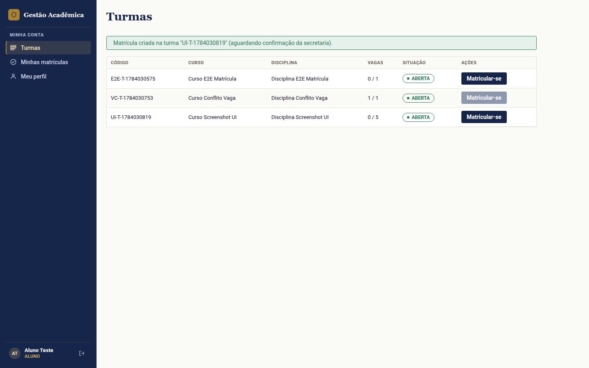
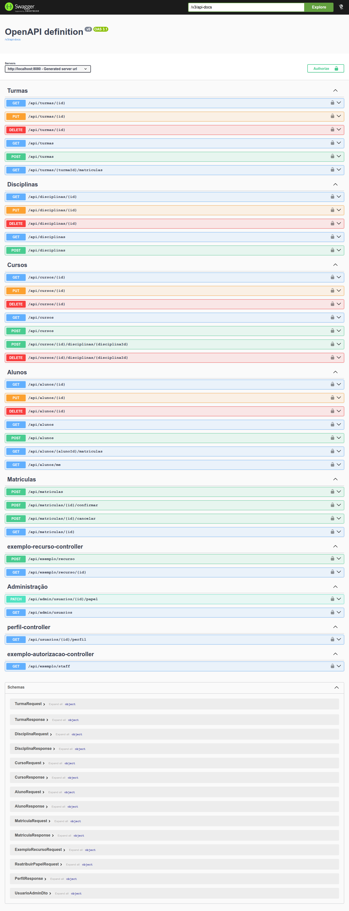
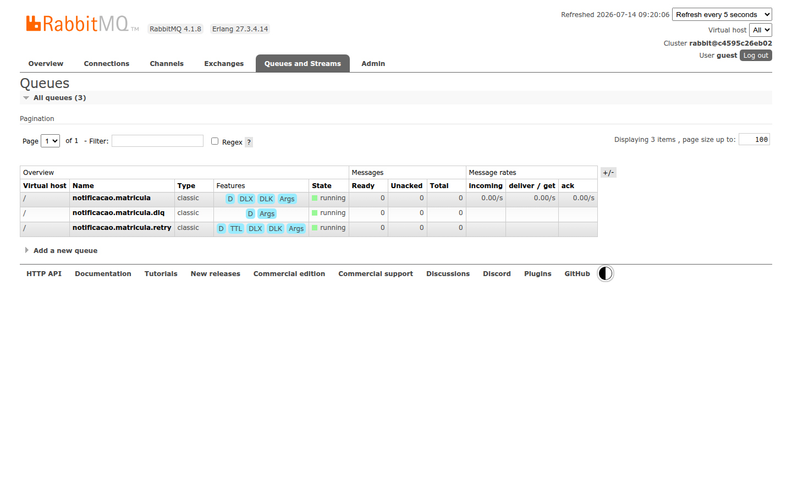
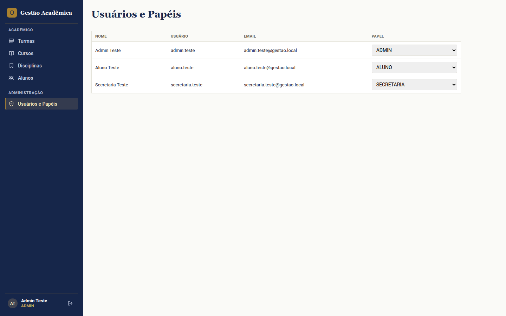
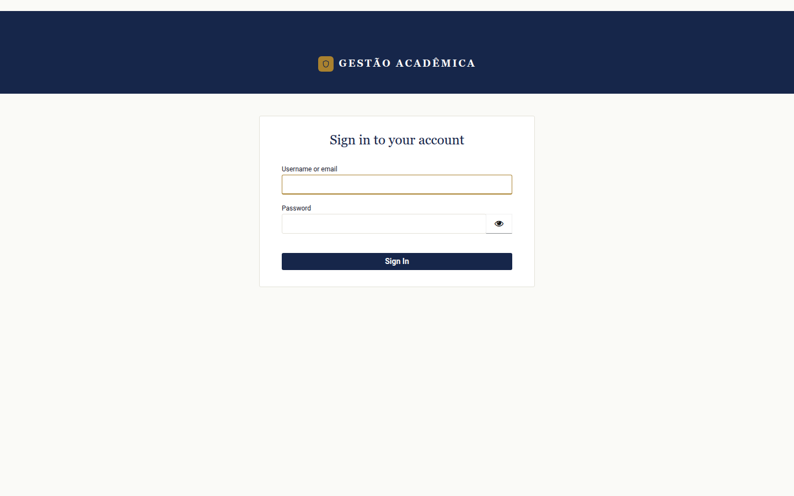

# Gestão de Matrículas Acadêmicas

Desafio técnico — Desenvolvedor(a) Sênior Full Stack, Tribe Lyceum – Techne. Sistema de
gestão de matrículas acadêmicas (Spring Boot + Angular). Ver `PRD.md` para a especificação
completa e `docs/DECISIONS.md` para o histórico de decisões técnicas.

> **Status:** domínio completo (Aluno, Curso, Disciplina, Turma, Matrícula), segurança
> RBAC/ABAC via Keycloak, mensageria assíncrona (RabbitMQ) e frontend Angular implementados
> e validados — ver `docs/ROADMAP.md` para o status por fase, `docs/ARQUITETURA.md` para o
> documento arquitetural curto de entrevista (decisões, trade-offs, riscos e caminho de
> evolução) e `docs/DECISIONS.md` para o log granular de decisões técnicas de cada uma.

## Como rodar localmente

Pré-requisitos: Java 21, Docker e Docker Compose.

1. Copie o arquivo de variáveis de ambiente de exemplo e ajuste os valores:
   ```
   cp .env.example .env
   ```
2. Suba a infraestrutura (Postgres, Redis, RabbitMQ, Keycloak):
   ```
   docker compose up -d
   ```
   Para incluir também a stack de observabilidade (Prometheus, Grafana, Jaeger, Loki):
   ```
   docker compose --profile observability up -d
   ```

A partir daqui há duas opções equivalentes para rodar a própria aplicação — escolha uma:

**Opção A — `./mvnw spring-boot:run` (recomendada para desenvolvimento ativo):**

```
./mvnw spring-boot:run
```

Mais rápida para iterar (sem rebuild de imagem a cada mudança de código). Continua sendo o fluxo
originalmente adotado neste projeto (`docs/DECISIONS.md`, D003).

**Opção B — tudo em Docker Compose, incluindo a própria aplicação (D057):**

```
docker compose --profile app up -d --build
```

Sobe a aplicação (`Dockerfile` multi-stage, build com o Maven wrapper + runtime JRE) junto com o resto da
infraestrutura, num único comando — fecha o pedido literal do PRD ("Docker Compose subindo aplicação,
banco de dados e mensageria"). O serviço `app` roda com `network_mode: host` (só funciona em Linux — ambiente
de desenvolvimento deste projeto): o container enxerga `localhost:5432`/`localhost:8081`/`localhost:5672`
exatamente como o processo do host já enxerga na Opção A, então o `issuer-uri` do JWT e a validação de token
continuam batendo sem nenhuma mudança em `application.properties`. Fica atrás de um profile próprio
(`app`, mesmo padrão do profile `observability`) justamente para não colidir na porta 8080 com a Opção A —
`docker compose up -d` (sem `--profile app`) continua subindo só a infraestrutura, como sempre subiu; use
uma opção OU a outra, não as duas ao mesmo tempo.

Como o serviço `app` não usa o `spring-boot-docker-compose` (não há socket do Docker disponível dentro do
container — o mesmo trade-off já rejeitado para o Promtail, ver D007/D017), a conexão com Postgres/RabbitMQ é
passada explicitamente via variáveis de ambiente no `compose.yaml` (`SPRING_DATASOURCE_*`/`SPRING_RABBITMQ_*`),
em vez de auto-descoberta.

Em ambas as opções, a aplicação sobe em `http://localhost:8080`. Swagger UI em
`http://localhost:8080/swagger-ui.html`.

## Frontend (Angular)

Projeto Angular 20 (standalone components) em `frontend/`, independente do backend Maven — consome a
API REST e autentica via Keycloak (`keycloak-js`/`keycloak-angular`, D036).

Pré-requisitos: Node.js 20+ e a infraestrutura do compose já no ar (o frontend depende do backend em
`:8080` e do Keycloak em `:8081`).

```
cd frontend
npm install
npm start          # equivalente a `ng serve`
```

A aplicação sobe em `http://localhost:4200` e recarrega automaticamente a cada mudança de arquivo.

Outros comandos úteis:

```
npm test            # testes unitários dos services (Karma/Jasmine)
npm run build       # build de produção em frontend/dist/
```



Evidência do frontend consumindo a API real: tela "Turmas" logada como `aluno.teste`, mostrando as turmas
abertas disponíveis e a confirmação de uma matrícula recém-criada — não um mock estático.

**Configuração de ambiente:** `frontend/src/environments/environment.ts` define para onde o frontend
aponta — não precisa de `.env` próprio, mas precisa estar alinhado com o backend/Keycloak locais:

```ts
export const environment = {
  apiBaseUrl: 'http://localhost:8080',
  keycloak: {
    url: 'http://localhost:8081',
    realm: 'gestao',
    clientId: 'gestao-frontend',
  },
};
```

Para o backend aceitar as chamadas do frontend, a origem `http://localhost:4200` precisa estar liberada
em `APP_FRONTEND_ORIGIN` (CORS, `docs/DECISIONS.md` D042) — já é o valor default se a variável não for
definida.

## Como rodar os testes

```
./mvnw clean verify
```

Roda os testes automatizados (unitários + integração via Testcontainers) e o gate de
cobertura JaCoCo (≥ 80% de linha/branch, exclusões documentadas em `docs/DECISIONS.md`,
D014).

**E2E de fluxo de negócio (bash + `curl`):** scripts em `e2e/*.sh`, cada um cobrindo um
fluxo ponta a ponta real (HTTP + Keycloak reais, não simulados) — `smoke-test.sh`
(infraestrutura), `matricula-flow.sh` (fluxo de matrícula, `specs/006-matricula.md`) e
`administracao-papel-flow.sh` (reatribuição de papel, `specs/010-...`). Pressupõem a stack
já de pé — tanto com a aplicação via `./mvnw spring-boot:run` (Opção A) quanto via
`docker compose --profile app up -d` (Opção B, D057); os dois casos falam com a mesma porta
`8080`, então nenhum script muda. É o que o job `build` do CI executa depois de
`./mvnw clean verify`:

```bash
bash e2e/smoke-test.sh
bash e2e/matricula-flow.sh
bash e2e/administracao-papel-flow.sh
```

**E2E de concorrência (Playwright):** prova a disputa de 20 alunos pela última vaga de uma
turma, 10 execuções consecutivas. Requer Node 22.

```bash
cd e2e/playwright
npm install
npx playwright test --repeat-each=10
```

Pressupõe a mesma stack já de pé que os demais scripts de `e2e/` (Postgres/Keycloak via
`docker compose up`, aplicação via `./mvnw spring-boot:run`). Detalhe do mecanismo provado
e dos números reais coletados na seção "Proteção de vaga e prova de concorrência" abaixo.

## Tecnologias

Java 21, Spring Boot 3.5, Spring Modulith, Spring Security (OAuth2 Resource Server),
PostgreSQL + Flyway, Redis, RabbitMQ, Keycloak, Prometheus + Grafana + Jaeger + Loki
(observabilidade), JaCoCo. Ver `pom.xml` e `CLAUDE.md` para a lista completa.



Evidência de que a documentação OpenAPI 3.1 (`springdoc-openapi-starter-webmvc-ui`) está de fato servida
em `/swagger-ui.html` e cobre todos os grupos de recursos da API (Turmas, Disciplinas, Cursos, Alunos,
Matrículas, Administração, etc.), não só os endpoints principais.

## Mensageria assíncrona (RabbitMQ)

Eventos de domínio de Matrícula (`MatriculaCriada`/`Confirmada`/`Cancelada`) são publicados
internamente via Spring Modulith e externalizados automaticamente para o RabbitMQ
(`spring-modulith-events-amqp`, `@Externalized` nos records de evento — ver
`specs/007-mensageria-rabbitmq.md`, D032). O consumidor de referência
(`MatriculaNotificacaoListener`, módulo `notificacao`) roda em `@RabbitListener` real,
com idempotência (dedupe por `eventId` em `evento_processado`) e retry+DLQ nativos do
RabbitMQ (D033):

- Falha no processamento → mensagem vai para `notificacao.matricula.retry` (TTL de 10s)
  → volta automaticamente para `notificacao.matricula` para nova tentativa.
- Após 3 tentativas, a mensagem é enviada para `notificacao.matricula.dlq` (fila final) —
  nunca é perdida silenciosamente.

**Como inspecionar filas/DLQ manualmente:** RabbitMQ Management UI em
`http://localhost:${RABBITMQ_MANAGEMENT_PORT:-15672}` (credenciais em `.env`,
`RABBITMQ_DEFAULT_USER`/`RABBITMQ_DEFAULT_PASS`). Na aba **Queues**, `notificacao.matricula.dlq`
mostra mensagens que esgotaram as tentativas — é possível inspecionar o payload (aba
**Get messages**) e reenviar manualmente para `notificacao.matricula` (aba **Publish
message**, mesmo exchange `gestao.eventos` e routing key original) para forçar um novo
processamento; a idempotência (`evento_processado`) garante que isso não duplica o efeito
se a mensagem já tiver sido processada com sucesso antes de cair na DLQ.



Evidência de que a topologia de retry/DLQ descrita acima existe de fato no broker, não só no código: as
três filas `notificacao.matricula`, `notificacao.matricula.retry` (TTL) e `notificacao.matricula.dlq`,
todas no estado `running`.

**Rastreabilidade (trace ID):** o `traceId` da requisição HTTP original que disparou o evento viaja no
próprio payload do evento (ao lado do `eventId` usado para idempotência) e aparece no log estruturado do
consumidor (`MDC`) — uma mensagem que cai na DLQ é rastreável de volta até a requisição que a originou. A
propagação nativa do Spring Boot/AMQP (`observation-enabled`) não cobre o caminho de externalização
assíncrona do Spring Modulith (thread separada, sem o contexto de span da requisição) — verificado
empiricamente; por isso o `traceId` é capturado explicitamente na thread da requisição, não no momento do
publish (ver `docs/DECISIONS.md`, D034).

**Confiabilidade sob falha do broker (outbox):** a tabela `event_publication`
(Event Publication Registry do Spring Modulith) registra cada publicação antes de tentar
entregá-la; se a aplicação cair ou o RabbitMQ estiver fora do ar entre persistir a
Matrícula e publicar o evento, a publicação fica incompleta e é reenviada automaticamente
no próximo start (`spring.modulith.events.republish-outstanding-events-on-restart=true`).

**Risco conhecido (não mitigado neste desafio):** a rede do compose não exige autenticação
adicional entre serviços além das credenciais do `.env` — aceitável em desenvolvimento,
mas exigiria mTLS/segmentação de rede em produção (ver `docs/DECISIONS.md`, D035).

## Proteção de vaga e prova de concorrência

A regra de negócio mais crítica do PRD (§02/§06: consumo de vaga sob matrícula concorrente)
é protegida por um `UPDATE` condicional atômico — `TurmaRepository.consumirVaga`,
`UPDATE turma SET vagas_ocupadas = vagas_ocupadas + 1, version = version + 1 WHERE id = ?
AND version = ? AND vagas_ocupadas < limite_vagas`, em produção desde a spec 006
(`docs/DECISIONS.md`, D024). A checagem e a escrita acontecem no mesmo statement SQL —
não há janela entre "ler vagas disponíveis" e "gravar a confirmação" em que duas
requisições concorrentes possam contar a mesma vaga como livre; o próprio lock de linha do
Postgres durante o `UPDATE` serializa as tentativas.

**Prova real (não teórica):** `e2e/playwright/tests/matricula-concorrencia-20-alunos.spec.ts`
dispara 20 confirmações verdadeiramente simultâneas (`Promise.all`, sem await sequencial)
contra 1 turma com 1 única vaga, via HTTP real e Keycloak real (não MockMvc/JWT simulado).
Repetido 10x consecutivas, duas vezes (20 execuções no total): em **todas** o resultado foi
exatamente **1×200 (sucesso) e 19×409 com `errorCode: VAGAS_ESGOTADAS`**, sem nenhuma
exceção não tratada, timeout ou resultado ambíguo — ver como rodar em "Como rodar os
testes" acima, e a decisão registrada em `docs/DECISIONS.md` (D053).

Saída real e completa de uma dessas execuções (`npx playwright test --repeat-each=10`, 10 repetições
consecutivas do mesmo cenário — 20 alunos disputando 1 vaga, `Promise.all` sem await sequencial):

```
Running 10 tests using 1 worker

  ✓   1 tests/matricula-concorrencia-20-alunos.spec.ts:102:5 › disputa de 20 alunos pela última vaga: exatamente 1 confirmação vence, 19 recebem 409 VAGAS_ESGOTADAS (1.2s)
  ✓   2 tests/matricula-concorrencia-20-alunos.spec.ts:102:5 › disputa de 20 alunos pela última vaga: exatamente 1 confirmação vence, 19 recebem 409 VAGAS_ESGOTADAS (1.0s)
  ✓   3 tests/matricula-concorrencia-20-alunos.spec.ts:102:5 › disputa de 20 alunos pela última vaga: exatamente 1 confirmação vence, 19 recebem 409 VAGAS_ESGOTADAS (937ms)
  ✓   4 tests/matricula-concorrencia-20-alunos.spec.ts:102:5 › disputa de 20 alunos pela última vaga: exatamente 1 confirmação vence, 19 recebem 409 VAGAS_ESGOTADAS (880ms)
  ✓   5 tests/matricula-concorrencia-20-alunos.spec.ts:102:5 › disputa de 20 alunos pela última vaga: exatamente 1 confirmação vence, 19 recebem 409 VAGAS_ESGOTADAS (846ms)
  ✓   6 tests/matricula-concorrencia-20-alunos.spec.ts:102:5 › disputa de 20 alunos pela última vaga: exatamente 1 confirmação vence, 19 recebem 409 VAGAS_ESGOTADAS (822ms)
  ✓   7 tests/matricula-concorrencia-20-alunos.spec.ts:102:5 › disputa de 20 alunos pela última vaga: exatamente 1 confirmação vence, 19 recebem 409 VAGAS_ESGOTADAS (861ms)
  ✓   8 tests/matricula-concorrencia-20-alunos.spec.ts:102:5 › disputa de 20 alunos pela última vaga: exatamente 1 confirmação vence, 19 recebem 409 VAGAS_ESGOTADAS (761ms)
  ✓   9 tests/matricula-concorrencia-20-alunos.spec.ts:102:5 › disputa de 20 alunos pela última vaga: exatamente 1 confirmação vence, 19 recebem 409 VAGAS_ESGOTADAS (811ms)
  ✓  10 tests/matricula-concorrencia-20-alunos.spec.ts:102:5 › disputa de 20 alunos pela última vaga: exatamente 1 confirmação vence, 19 recebem 409 VAGAS_ESGOTADAS (698ms)

  10 passed (12.4s)
EXIT=0
```

**Por que `UPDATE` atômico em vez de lock pessimista:** uma comparação numérica separada,
a nível de JVM/repository (N=10 threads disputando 1 vaga, `src/test/java/.../academico/
concorrencia/`, nunca em produção — D051), mostrou corretude idêntica entre as duas
estratégias (1 sucesso, 9 conflitos, 0 exceções inesperadas em ambas) e diferença de tempo
estatisticamente insignificante (32ms vs. 33ms, ruído de medição). Com nenhuma vantagem de
performance demonstrada pelo lock pessimista, e como a estratégia atômica evita manter um
lock de linha aberto pela duração de uma transação, a decisão final (D053) foi manter o
`UPDATE` condicional (D024) — nenhuma mudança em produção. Resposta de entrevista completa,
com os números e o raciocínio de escala, em `specs/012-concorrencia-e-testes.md`, seção 10.

## Observabilidade

A stack completa (Prometheus, Grafana, Jaeger, Loki, Promtail) sobe com
`docker compose --profile observability up -d` (D008 — fica fora do `docker compose up` do dia a dia,
que só traz postgres/redis/rabbitmq/keycloak). Todas as UIs abaixo ficam restritas a `127.0.0.1`
(só acessíveis da própria máquina).

| Ferramenta | URL | Credenciais |
|---|---|---|
| Grafana | `http://localhost:${GRAFANA_PORT:-3000}` | `GRAFANA_ADMIN_USER`/`GRAFANA_ADMIN_PASSWORD` (`.env`) |
| Prometheus | `http://localhost:${PROMETHEUS_PORT:-9090}` | nenhuma (uso local) |
| Jaeger UI | `http://localhost:${JAEGER_UI_PORT:-16686}` | nenhuma (uso local) |
| Loki | sem UI própria — consultado via Grafana Explore | — |

No Grafana, os datasources (Prometheus, Jaeger, Loki) já vêm provisionados, junto com um dashboard
padrão **"Gestão - JVM & HTTP (básico)"** (heap da JVM, requisições HTTP/s, uptime, CPU e conflitos de
vaga na confirmação de matrícula — D009/D052), pronto sem nenhuma configuração manual na UI.

Explicação de papel/funcionamento/conexão de cada componente (pull vs. push, o que cada um armazena),
incluindo o painel de negócio `matricula.vaga.conflito` (D052) e como logs e traces se correlacionam
(`derivedFields` do Grafana — e por que essa correlação **não** atravessa a mensageria assíncrona, D034):
**[docs/OBSERVABILIDADE.md](docs/OBSERVABILIDADE.md)**.

**Actuator exposto:**
- `GET /actuator/health` — público, sem autenticação.
- `GET /actuator/prometheus` — protegido por HTTP Basic Auth (usuário `prometheus`, senha em
  `PROMETHEUS_SCRAPE_PASSWORD`, mesmo valor configurado no scrape job do `docker/prometheus/prometheus.yml`).

## Autenticação (Keycloak)

Console de administração: `http://localhost:${KEYCLOAK_HTTP_PORT:-8081}` — login com `KEYCLOAK_ADMIN`/
`KEYCLOAK_ADMIN_PASSWORD` (`.env`).

O realm `gestao` é importado automaticamente ao subir o container (`start-dev --import-realm`, sem
nenhum passo manual na UI) a partir de `docker/keycloak/import/gestao-realm.json`. Ele define:

- **Papéis (realm roles):** `ALUNO`, `SECRETARIA`, `ADMIN` (D011).
- **Clients:** `gestao-frontend` (público, Authorization Code + PKCE, usado pelo Angular) e
  `gestao-backend` (confidential, secret via `KEYCLOAK_BACKEND_CLIENT_SECRET`). Este último tem um
  consumidor de código real desde a spec 010: `AdministracaoUsuarioService` autentica na Admin API do
  Keycloak via `client_credentials` (`serviceAccountsEnabled: true` + client roles `view-users`/
  `manage-users`/`query-users`/`view-realm` de `realm-management` atribuídas ao seu service account,
  `docker/keycloak/import/gestao-realm.json` — ver `docs/DECISIONS.md`, D045/D046).

**Usuários de teste** (credenciais de desenvolvimento, válidas só neste Keycloak local — nunca usar fora
deste ambiente):

| Usuário | Senha | Papel | O que pode fazer |
|---|---|---|---|
| `aluno.teste` | `aluno123` | `ALUNO` | Ver/editar o próprio perfil (`GET /api/alunos/me`, D041), ver turmas disponíveis, matricular-se, ver e cancelar as próprias matrículas |
| `secretaria.teste` | `secretaria123` | `SECRETARIA` | CRUD completo de Aluno/Curso/Disciplina/Turma, confirmar matrícula de qualquer aluno |
| `admin.teste` | `admin123` | `ADMIN` | Mesmo acesso de `SECRETARIA` + administração de usuários/papéis via `/administracao/usuarios` — única regra que hoje distingue ADMIN de SECRETARIA no backend (D045) |

Para obter um token manualmente (ex: testar a API via `curl`), o client `gestao-frontend` tem
`directAccessGrantsEnabled: true` (grant de senha direta), usado pelo próprio `e2e/matricula-flow.sh`:

```
curl -s -X POST "http://localhost:${KEYCLOAK_HTTP_PORT:-8081}/realms/gestao/protocol/openid-connect/token" \
  -d "client_id=gestao-frontend" -d "grant_type=password" \
  -d "username=aluno.teste" -d "password=aluno123" | jq -r .access_token
```

### Administração de usuários/papéis

Tela em `/administracao/usuarios` (só visível/acessível a `ADMIN`, item de sidebar próprio — ver
`specs/010-administracao-usuarios-papeis.md`): lista os usuários do realm `gestao` com papel atual e
permite reatribuir o papel (`ALUNO`/`SECRETARIA`/`ADMIN`) de um usuário já existente via `<select>` inline
por linha, sem tela de formulário separada. Esta é a primeira e única regra do sistema que hoje diferencia
`ADMIN` de `SECRETARIA` (D045).



Evidência da tela funcionando com os 3 papéis distintos: os 3 usuários de teste listados com seu papel
atual correto nos `<select>` de reatribuição (`aluno.teste`→`ALUNO`, `admin.teste`→`ADMIN`,
`secretaria.teste`→`SECRETARIA`), confirmando que a tela lê o papel real de cada usuário via Admin API do
Keycloak, não um valor default estático.

O backend fala com a **Admin API do Keycloak** via `client_credentials`, usando o client confidential
`gestao-backend` (`org.keycloak:keycloak-admin-client`, SDK oficial — `KeycloakAdminConfig`,
`AdministracaoUsuarioService`). Isso exige, no client `gestao-backend` do realm `gestao`:

- `"serviceAccountsEnabled": true`;
- os client roles `view-users`, `manage-users`, `query-users` e `view-realm` de `realm-management`
  atribuídos ao service account desse client.

Ambos já vêm configurados em `docker/keycloak/import/gestao-realm.json` (importado automaticamente ao
subir o Keycloak — nenhum passo manual necessário no ambiente local do `compose.yaml`; ver
`docs/DECISIONS.md`, D045/D046). **Sem essa configuração, `GET /api/admin/usuarios` responde 500**
(`ForbiddenException` da Admin API do Keycloak ao consultar membros de role) — se for reproduzir este
realm do zero fora do `compose.yaml`, confira esse role mapping do service account antes de tudo.

**Tema visual do login:** a tela de login do Keycloak usa um tema próprio (Keycloakify,
`keycloak-theme/`, tema `gestao-academico`) que reaplica a mesma identidade "Institucional acadêmico" do
frontend Angular (specs 009 e 011). Antes de subir o Docker Compose (ou sempre que o código em
`keycloak-theme/src` mudar), gere o artefato do tema:

```bash
cd keycloak-theme && npm install && npm run build-keycloak-theme
```

Isso cria `keycloak-theme/dist_keycloak/keycloak-theme.jar`, montado automaticamente em
`/opt/keycloak/providers` pelo `compose.yaml` (`docker compose up`). Sem esse build, o Keycloak sobe com o
tema padrão (o volume simplesmente fica vazio). Como este `compose.yaml` não mantém volume persistente
para o Postgres do Keycloak, um `docker compose down && docker compose up` sempre reimporta o realm do
zero — não há passo manual adicional para o `loginTheme` ser aplicado.



Evidência do tema Keycloakify aplicado de fato (não o tema padrão do Keycloak): a tela de login em
`http://localhost:8081/realms/gestao/...` já renderiza com a identidade visual "Gestão Acadêmica" descrita
acima, para o fluxo OAuth2 do client `gestao-frontend`.

## Documentação

- `docs/ROADMAP.md` — planejamento em fases feito antes de começar, e como a execução real
  divergiu desse plano (material de apoio para a entrevista técnica).
- `docs/ARQUITETURA.md` — documento arquitetural curto: decisões, trade-offs, riscos
  conhecidos e caminho de evolução (puxa de `docs/DECISIONS.md`).
- `docs/OBSERVABILIDADE.md` — como acessar Grafana, Prometheus e Jaeger, formato/localização
  dos logs estruturados e quais endpoints do Actuator estão expostos.
- `docs/DECISIONS.md` — log de decisões técnicas (o que foi decisão deliberada vs. default
  aceito da IA).
- `specs/` — spec de cada fase do desenvolvimento (inclui `specs/008-frontend-angular.md`, com o detalhe
  completo das telas, decisões e validação manual do frontend).
- `CLAUDE.md` — guia de arquitetura e fluxo de trabalho do projeto.

## Uso de IA

Este projeto foi desenvolvido com apoio de Claude Code em todas as fases (planejamento,
specs, implementação, revisão de código e segurança). Toda decisão técnica não-trivial —
inclusive quais foram sugestões da IA aceitas sem alteração vs. decisões ativas do autor —
está registrada em `docs/DECISIONS.md`, com a origem de cada uma classificada
explicitamente. Achados de `code-reviewer`/`security-auditor` (também via IA) que geraram
mudança de implementação estão documentados nas specs correspondentes em `specs/`.

**Contagem por origem** (59 entradas reais em `docs/DECISIONS.md`, `grep -c '^## D[0-9]'`; a busca
`grep -c '^\*\*Origem:\*\*'` retorna 60 porque também casa a linha de exemplo do próprio template
"`**Origem:** 🧑 / 🤝 / 🤖`" — descontada abaixo):

- 🧑 17 decisões ativas do Pablo (a IA não decidiu, só executou ou apresentou alternativas).
- 🤝 10 sugestões da IA revisadas/ajustadas pelo Pablo antes de aceitas.
- 🤖 31 defaults da IA aceitos sem alteração.
- 1 entrada de origem mista (D047, tema com vários pontos de decisão independentes — origem
  registrada ponto a ponto dentro da própria entrada).

`docs/DECISIONS.md` continua sendo a fonte primária e granular — a lista abaixo não a substitui,
apenas aponta, para quem for revisar rápido, os trechos com maior peso técnico e que passaram por
revisão manual mais próxima (não só "gerado e aceito"):

1. **Proteção do limite de vagas sob concorrência** ([D024](docs/DECISIONS.md#d024),
   [D053](docs/DECISIONS.md#d053)) — a estratégia (`UPDATE` condicional atômico + `@Version`, PRD
   §06, critério eliminatório) só foi fechada depois que o Pablo pediu prova real em vez de aceitar
   a recomendação de cara ("quero uma solução robusta de mercado"); D053 registra a comparação
   empírica final (e2e com 20 alunos disputando a última vaga, 20/20 execuções corretas, e
   comparação numérica atômico vs. lock pessimista) que confirmou manter a estratégia atômica.
2. **Propagação de trace ID até o consumidor da fila** ([D034](docs/DECISIONS.md#d034)) — a
   opção recomendada inicialmente (suporte nativo do Spring Boot/AMQP via Observation) e o
   fallback cogitado (`MessagePostProcessor` manual) foram os dois testados contra a aplicação
   real e os dois falharam (a publicação do Modulith roda em thread própria, fora do `ThreadLocal`
   de span da requisição HTTP); o mecanismo final (capturar o `traceId` na thread da requisição e
   propagá-lo no próprio payload do evento) só existe por causa dessa verificação empírica.
3. **TOCTOU nas checagens de unicidade sob concorrência** ([D031](docs/DECISIONS.md#d031), item 1)
   — achado conjunto de `code-reviewer` (Médio-Alto) e `security-auditor` (Médio): duas
   requisições concorrentes podiam ambas passar a checagem `existsBy...` e uma violar a
   constraint de unicidade no banco, degradando para 500 em vez de 409; corrigido com um handler
   global (`DataIntegrityViolationException` → 409) antes de a spec ser considerada concluída.
4. **Bug latente de credenciais RabbitMQ em 6 classes de teste** ([D059](docs/DECISIONS.md#d059))
   — encontrado rodando o gate final (`./mvnw clean verify` em ambiente novo): ao isolar o Postgres
   via `PostgreSQLContainer`, as 6 classes desligavam `spring.docker.compose.enabled` por inteiro,
   derrubando também a autodescoberta do RabbitMQ e fazendo o client cair no default `guest/guest`.
   Escalado ao Pablo antes de corrigir (não corrigido silenciosamente); corrigido espelhando o
   padrão de `RabbitMQContainer` já usado em outras duas classes do projeto.
5. **Dropdown de papel sempre exibindo "ALUNO" na tela de administração** (commits `9a31930`
   fix e `c1e7ec6` recaptura — bug de UI sem alternativa de design real, por isso fora de
   `DECISIONS.md`) — encontrado só porque um agente abriu e olhou o screenshot capturado como
   evidência em vez de confiar num log de "OK" de script; confirmado com um teste de componente
   descartável, escalado ao Pablo antes de corrigir, e corrigido com TDD
   (`usuarios-lista.component.spec.ts` RED → GREEN) trocando `[value]` no `<select>` por
   `[selected]` em cada `<option>` (o valor era aplicado antes das `<option>` filhas renderizarem
   via `@for`, então o browser sempre caía na primeira).
