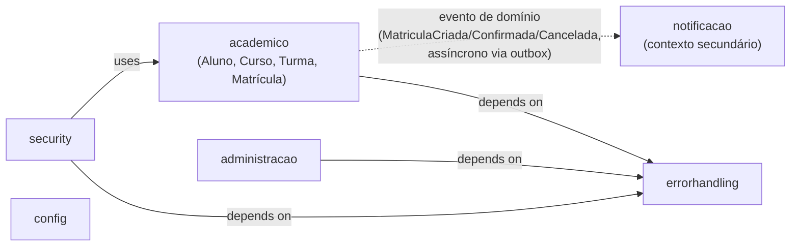
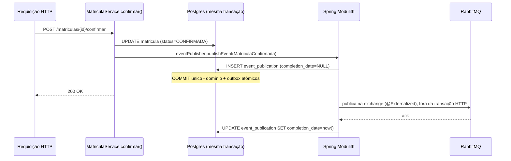

# Arquitetura — Gestão de Matrículas Acadêmicas

Documento curto, não é um substituto de [`docs/DECISIONS.md`](DECISIONS.md) (fonte granular, 59 decisões
registradas até esta fase) — aqui está a história arquitetural, com link pontual para profundidade quando
precisar.

## Visão geral

Monólito modular via Spring Modulith. `ApplicationModules.of(GestaoApplication.class)` enxerga 6 pacotes de
nível superior sob `br.com.desafio.tecnico.gestao` como módulos: `academico` (domínio de matrícula —
Aluno, Curso, Disciplina, Turma, Matrícula), `notificacao` (contexto secundário, reage a eventos de
domínio), `administracao` (gestão de usuários/papéis via Admin API do Keycloak), `security` (configuração
transversal de autenticação/autorização), `errorhandling` (tratamento padronizado de erro) e `config`
(configuração cross-cutting — topologia RabbitMQ, OpenAPI).

O par que o PRD pede explicitamente separado — "contexto acadêmico" vs. "contexto
secundário" — é `academico`/`notificacao`: eles não trocam nenhuma chamada Java síncrona, só eventos de
domínio (`MatriculaCriada`, `MatriculaConfirmada`, `MatriculaCancelada`). Os demais módulos
(`administracao`, `security`, `errorhandling`, `config`) são suporte cross-cutting e se comunicam por
chamada direta normal — aceitável dentro de um monólito modular, e ainda assim verificado em tempo de teste
(`ModularidadeTest.modulosRespeitamOsLimitesDeEncapsulamento()`, que falha o build se algum módulo referenciar
um tipo *interno* de outro em vez da API pública/eventos).



Por quê monólito modular em vez de microsserviços desde o início: [D001](DECISIONS.md#d001) — o PRD pede
desacoplamento real e demonstrável, não múltiplos processos literais. Trade-off aceito: sem isolamento de
deploy entre os módulos; ganho real: `ApplicationModules.verify()` reforça o limite entre contextos em
tempo de teste — ver `docs/architecture/modules.puml`, gerado automaticamente a partir do mesmo mecanismo
(`ModularidadeTest.geraDocumentacaoDeModulos()`, `org.springframework.modulith.docs.Documenter`).

**Nota sobre o `.puml` comitado:** o diagrama de componentes agregado que o `Documenter` gerou mostra 5
caixas (`Academico`, `Administracao`, `Errorhandling`, `Notificacao`, `Security`) — o módulo `config`
existe de fato (`ApplicationModules.of(...)` o reconhece como o sexto módulo) mas não aparece como caixa
nesse diagrama específico, provavelmente por não expor nenhum tipo além de beans `@Configuration`
consumidos via constante estática (`MensageriaConfig.EXCHANGE_EVENTOS` etc.), não via injeção/API de
domínio — mesmo padrão descrito em [D035](DECISIONS.md#d035) para por que a topologia do RabbitMQ vive em
`config` e não em `academico`/`notificacao`. Além disso, a aresta `Notificacao -> Academico "depends on"`
no `.puml` reflete uma dependência de **compilação** (o listener de `notificacao` importa os records de
evento públicos de `academico`, ex. `MatriculaCriada`) — a direção do **fluxo em tempo de execução** é a
oposta (`academico` publica, `notificacao` consome), que é o que o diagrama Mermaid acima destaca com a seta
tracejada.

## Decisões mais defensáveis

### D001 — Monólito modular vs. microsserviços

Microsserviços desde o início atenderiam ao requisito do PRD de forma mais "óbvia" para quem lê o README,
mas para um desafio de 7 dias corridos introduzem custo de infraestrutura (service discovery, contratos
entre serviços, deploy duplicado) desproporcional ao ganho real de desacoplamento nesse escopo. O monólito
modular com Spring Modulith entrega o mesmo desacoplamento *verificável* (`ApplicationModules.verify()`,
eventos de domínio entre módulos) sem esse custo, e mantém um caminho de evolução claro — ver "Caminho de
evolução" abaixo. Trade-off aceito e assumido: sem isolamento de deploy/processo entre os módulos. Detalhe
completo: [D001](DECISIONS.md#d001).

### D024/D053 — Estratégia de concorrência na regra de vagas

`UPDATE` condicional atômico (`WHERE vagas_ocupadas < limite_vagas AND version = ?`) + `@Version` mantido
na entidade `Turma` para outros campos ([D024](DECISIONS.md#d024)), não lock pessimista. Números reais da
Fase 6 (specs/012): prova e2e de 20 alunos disputando a última vaga de uma turma, confirmações verdadeiramente
simultâneas via `Promise.all`, repetidas 10x consecutivas duas vezes (20/20 execuções totais) — em todas,
exatamente 1×200 e 19×409 `VAGAS_ESGOTADAS`, sem exceção não tratada, sem timeout, sem resultado ambíguo.
Comparação JVM isolada (N=10 threads disputando M=1 vaga, uma execução por estratégia): atômica —
`sucessos=1, conflitos=9, excecoesInesperadas=0, tempoTotalMs=32`; pessimista (`PESSIMISTIC_WRITE`, código
isolado em `src/test/java`, nunca em produção — D051 em [DECISIONS.md](DECISIONS.md)) —
`sucessos=1, conflitos=9, excecoesInesperadas=0, tempoTotalMs=33`. Corretude idêntica; a diferença de tempo
(32ms vs. 33ms) é estatisticamente insignificante e, como a revisão final de branch apontou, as duas
execuções nem fazem exatamente o mesmo trabalho no banco (a atômica decide o vencedor pelo predicado de
`version`, sem serialização real de lock; a pessimista serializa de fato) — a comparação de tempo já era
tratada como ruído, não como decisão. Decisão final (D053 em [DECISIONS.md](DECISIONS.md)): manter a atômica, sem
ganho demonstrado da pessimista para justificar a troca.

### D002 — RabbitMQ vs. Kafka

Kafka é forte em replay e alto volume, mas a operação (Zookeeper/KRaft, tópicos, partições) é
desproporcional ao volume e ao prazo de 7 dias deste desafio. RabbitMQ, com seu modelo de filas/AMQP, é mais
simples de operar, configurar e explicar em entrevista, com management UI pronta para inspecionar
filas/mensagens durante o desenvolvimento — sem requisito de throughput/replay que justificasse a
complexidade adicional do Kafka. Detalhe completo: [D002](DECISIONS.md#d002).

## Outbox: como funciona neste projeto (Spring Modulith Event Publication Registry)

**Por que outbox existe, em uma frase:** sem ele, salvar o estado da Matrícula no banco e publicar o
evento no RabbitMQ seriam duas escritas separadas ("dual write") — se a segunda falhar depois da primeira
ter sucesso, o evento se perde silenciosamente; o outbox garante que a publicação do evento é atômica com a
mudança de estado, porque as duas acontecem na mesma transação de banco.

**Por que isso não aparece como uma classe `OutboxPublisher` no código:** não existe nenhuma classe assim
neste projeto, nem uma tabela `outbox` criada à mão. O padrão inteiro é implementado pela infraestrutura do
Spring Modulith (`spring-modulith-starter-jpa` + `spring-modulith-events-amqp`) — quem não conhece o
framework não vai encontrar isso lendo o código de negócio, só a configuração.

**Fluxo concreto, passo a passo:**



1. `eventPublisher.publishEvent(...)` é chamado **dentro** do método `@Transactional` que muda o estado
   (`MatriculaService.criar()`/`confirmar()`/`cancelar()`, `src/main/java/br/com/desafio/tecnico/gestao/academico/service/MatriculaService.java`,
   linhas 68-93/95-136/138-158) — mesma transação, mesmo commit/rollback.
2. `spring-modulith-starter-jpa` (auto-configurado, sem bean explícito) grava uma linha em
   `event_publication` (schema em
   `src/main/resources/db/migration/V8__infraestrutura_criar_tabela_event_publication.sql`, copiado
   literalmente do schema do `spring-modulith-events-jdbc`) com `completion_date IS NULL` — isso é o
   outbox.
3. Cada record de evento (`MatriculaCriada`, `MatriculaConfirmada`, `MatriculaCancelada`, em
   `src/main/java/br/com/desafio/tecnico/gestao/academico/`) leva a anotação
   `@Externalized(MensageriaConfig.EXCHANGE_EVENTOS + "::" + <routing key>)` — é essa anotação, sozinha, que
   faz o `spring-modulith-events-amqp` publicar o evento no RabbitMQ depois do commit, sem nenhum código de
   dispatcher escrito à mão.
4. Se a entrega tiver sucesso, `event_publication.completion_date` é marcado. Se falhar (broker fora do ar,
   por exemplo), a linha continua com `completion_date IS NULL`.
5. A property `spring.modulith.events.republish-outstanding-events-on-restart=true`
   (`src/main/resources/application.properties:63`) faz a aplicação reconsultar `event_publication` por
   linhas incompletas no próximo start e reenviar — prova disso, com o RabbitMQ deliberadamente parado, em
   `src/test/java/br/com/desafio/tecnico/gestao/notificacao/OutboxReenvioIntegrationTest.java` (dois
   contextos Spring reais, start → stop do RabbitMQ → start, não um mock de reinício).

**Mapa "onde está no código":**

| Peça | Arquivo |
|---|---|
| Publicação (dentro da transação) | `academico/service/MatriculaService.java` (`criar()`/`confirmar()`/`cancelar()`) |
| Records de evento + `@Externalized` | `academico/MatriculaCriada.java`, `MatriculaConfirmada.java`, `MatriculaCancelada.java` |
| Schema da tabela outbox | `db/migration/V8__infraestrutura_criar_tabela_event_publication.sql` |
| Reenvio após restart | `application.properties:59-63` (`republish-outstanding-events-on-restart`) |
| Prova de reenvio | `notificacao/OutboxReenvioIntegrationTest.java` |
| Topologia RabbitMQ (exchange/filas/DLQ) | `config/MensageriaConfig.java` |
| Consumidor + idempotência | `notificacao/MatriculaNotificacaoListener.java`, tabela `evento_processado` (V9) |

**Evidência concreta:** consulta real contra a tabela `event_publication` do Postgres da aplicação (via
`docker exec -i gestao-educacao-postgres-1 psql -U myuser -d mydatabase`), logo após uma disputa de vaga
real disparada em ambiente local:

```
                         event_type                          | completa
-------------------------------------------------------------+----------
 br.com.desafio.tecnico.gestao.academico.MatriculaConfirmada | t
 br.com.desafio.tecnico.gestao.academico.MatriculaCriada     | t
 br.com.desafio.tecnico.gestao.academico.MatriculaCriada     | t
 br.com.desafio.tecnico.gestao.academico.MatriculaCriada     | t
 br.com.desafio.tecnico.gestao.academico.MatriculaConfirmada | t
 br.com.desafio.tecnico.gestao.academico.MatriculaCriada     | t
 br.com.desafio.tecnico.gestao.academico.MatriculaCriada     | t
 br.com.desafio.tecnico.gestao.academico.MatriculaConfirmada | t
 br.com.desafio.tecnico.gestao.academico.MatriculaCriada     | t
 br.com.desafio.tecnico.gestao.academico.MatriculaCriada     | t
(10 rows)
```

Os 10 eventos de domínio mais recentes (`MatriculaCriada`/`MatriculaConfirmada`) aparecem com
`completa = t` — prova concreta de que a linha do outbox foi gravada na mesma transação do domínio e,
depois, marcada como entregue (`completion_date` preenchido) pelo `spring-modulith-events-amqp`, não uma
inferência a partir só do código.

**O que se ganha "de graça" vs. um outbox artesanal:** zero código de dispatcher/relay, reentrega
automática após restart, sem tabela nem lógica de retry escritas à mão. **Limitações aceitas:** reenvio só
acontece no restart da aplicação (não é um relay contínuo tipo Debezium/CDC monitorando a tabela em tempo
real) — para este escopo é suficiente; se a exigência fosse "reenviar em segundos, sem esperar restart",
seria hora de revisitar.

Decisões relacionadas: [D029](DECISIONS.md#d029) (eventos internos primeiro, RabbitMQ depois),
[D032](DECISIONS.md#d032) (topic exchange), [D033](DECISIONS.md#d033) (retry/DLQ),
[D034](DECISIONS.md#d034) (trace ID — por que a propagação nativa não bastou),
[D035](DECISIONS.md#d035) (eventId/idempotência/topologia).

## Riscos conhecidos aceitos

- **Rede do compose sem mTLS/segmentação entre serviços** ([D035](DECISIONS.md#d035)): qualquer container
  na mesma rede Docker alcança o RabbitMQ com as credenciais do `.env`. Aceitável no escopo de um ambiente
  de desenvolvimento local; exigiria mTLS ou rede segmentada em produção real.
- **Console de management do RabbitMQ concede administração completa do broker**, não só leitura (achado
  de security review, corrigido para restringir a publicação da porta a `127.0.0.1`, mesmo padrão do resto
  do `compose.yaml` — Keycloak, Grafana, Prometheus, Jaeger, Loki). Risco residual aceito: quem alcança o
  broker localmente ainda pode forjar um header `x-death` numa mensagem publicada diretamente e fazê-la cair
  direto na DLQ sem passar pelo fluxo de retry real — impacto limitado à integridade de métricas/
  observabilidade, sem perda de dado ou escalonamento de privilégio, e não introduz superfície nova além do
  acesso ao broker já considerado no ponto anterior ([D035](DECISIONS.md#d035)).
- **Isolamento de privilégio entre o Postgres da aplicação e o do Keycloak** ([D004](DECISIONS.md#d004)):
  corrigido após achado de security review (role dedicada `keycloak_app`, sem reaproveitar o superusuário
  da aplicação) — mantido aqui como exemplo de achado de security-auditor endereçado, não descartado.
- **Escala de concorrência na regra de vagas** ([D024](DECISIONS.md#d024)/D053 em [DECISIONS.md](DECISIONS.md)): a
  estratégia atômica atual foi validada para a escala testada (dezenas de requisições simultâneas pela
  mesma turma); se a carga real crescesse para um cenário de "flash sale" (milhares de req/s pela mesma
  linha), o próprio D024 já registra que valeria revisitar com reserva via Redis + fila.
- **Falha de mensageria mais longa que a janela de retry** ([D033](DECISIONS.md#d033)): sob uma falha
  transitória do RabbitMQ maior que ~30s (3 tentativas × 10s), a mensagem esgota as tentativas e vai para a
  DLQ mesmo que a causa raiz já tivesse se resolvido — aceito para o escopo do desafio; reprocessamento
  manual pela Management UI é sempre possível.
- **Credenciais são todas de desenvolvimento local**: usuários/senhas do Keycloak, RabbitMQ, Grafana etc.
  documentados no README existem só para rodar o `compose.yaml` localmente, nunca para um ambiente real —
  não há gestão de segredo (Vault/KMS) neste escopo.

## Caminho de evolução

Pergunta literal do PRD §09: "como você separaria esse módulo em outro serviço?" Como `academico` e
`notificacao` já só se comunicam por evento publicado — nunca por chamada Java síncrona — a extração é
principalmente uma troca de *processo*, não de *protocolo*: o transporte do evento já é o RabbitMQ real
(não uma fila em memória), então mover `notificacao` para um processo separado significa (1) copiar o
`@RabbitListener` e sua configuração de fila/exchange (`config/MensageriaConfig.java`) para uma aplicação
Spring Boot própria, apontando para o mesmo broker; (2) mover a tabela `evento_processado` (idempotência)
para o banco desse novo serviço; (3) desligar o binding do módulo `notificacao` na aplicação principal. Não
seria necessário reescrever nenhuma lógica de publicação em `academico` — ele já publica para um exchange
externo, sem saber (nem precisar saber) se quem consome está no mesmo processo ou não. O desacoplamento já
existe; falta só o segundo `docker run`.

Os demais módulos (`administracao`, `security`, `errorhandling`, `config`) são mais difíceis de extrair
como está — comunicam-se por chamada Java direta (`Rel(...) "uses"/"depends on"` no
`docs/architecture/modules.puml`), não por evento; extraí-los exigiria primeiro introduzir uma API
(REST/evento) onde hoje há uma chamada de método, o que hoje não é necessário porque nenhum requisito do
PRD pede a separação desses contextos especificamente.

## Tratamento de falhas de mensageria (resumo)

Retry com 3 tentativas e TTL fixo de 10s (fila de espera dedicada, dead-letter de volta para a fila
principal após o TTL — [D033](DECISIONS.md#d033)); depois de esgotar as tentativas, o próprio consumidor
publica explicitamente na DLQ nativa do RabbitMQ (`notificacao.matricula.dlq`), com log estruturado em WARN
e um contador Micrometer (`mensageria.dlq.eventos`) visível no Prometheus/Grafana. Idempotência de consumo
via tabela `evento_processado` (dedupe por `eventId`, gerado em `MatriculaService` e carregado no payload de
cada evento — [D035](DECISIONS.md#d035)), necessária porque redelivery é esperado (retry, e também o
reenvio de outbox após restart descrito acima) e o consumidor não pode assumir "at-most-once". Alternativas
consideradas e descartadas para o número de tentativas/TTL (5 tentativas com backoff incremental
10s/30s/60s) ficaram fora de escopo por desproporção ao prazo do desafio — ver [D033](DECISIONS.md#d033)
para o raciocínio completo e o trade-off aceito (mensagem pode ir para a DLQ mesmo que a falha transitória já
tivesse se resolvido, dentro da janela de ~30s de retry).

## Pitch de entrevista: índice pergunta → resposta pronta

Este projeto é, ao mesmo tempo, um desafio técnico e material de preparação de entrevista (PRD §09). Em vez
de procurar sob pressão durante a conversa, este índice aponta, para cada pergunta provável, onde a resposta
já está pronta — com número real por trás quando aplicável, não só afirmação. Cada ponteiro abaixo foi
conferido diretamente no código/documento nesta task (não é suposição de onde "deveria" estar).

| # | Pergunta provável (PRD §09) | Onde está a resposta pronta |
|---|---|---|
| 1 | "Mostre o fluxo de confirmação de matrícula" | `MatriculaService.confirmar()` (`src/main/java/br/com/desafio/tecnico/gestao/academico/service/MatriculaService.java`, linhas 96-136) — busca a matrícula, trata idempotência (D028) e transição inválida, chama `TurmaRepository.consumirVaga` para consumir a vaga atomicamente, recarrega a entidade gerenciada (ver comentário sobre `merge()`/D031 no próprio método) e publica `MatriculaConfirmada`. Diagrama de sequência completo (HTTP → service → outbox → RabbitMQ) na seção "Outbox: como funciona neste projeto" acima. Resumo operacional: README §"Proteção de vaga e prova de concorrência". |
| 2 | "Onde está protegida a regra de limite de vagas?" | `TurmaRepository.consumirVaga` (`src/main/java/br/com/desafio/tecnico/gestao/academico/repository/TurmaRepository.java`, linhas 61-64) — `UPDATE` condicional atômico via `@Query`/`@Modifying`. Decisão completa: [D024](DECISIONS.md#d024). |
| 3 | "O que acontece se duas pessoas tentarem se matricular ao mesmo tempo na última vaga?" | `specs/012-concorrencia-e-testes.md` §10 ("Resposta de entrevista preparada"), primeira pergunta — números reais: 20 confirmações simultâneas via `Promise.all`, 20 execuções totais (10 repetições × 2 rodadas), em **todas** exatamente 1×200 + 19×409 `VAGAS_ESGOTADAS`. Decisão final: [D053](DECISIONS.md#d053). Mesmos números replicados no README §"Proteção de vaga e prova de concorrência". |
| 4 | "Como você testou essa regra?" | Nível de integração (2 threads, mesmo processo): `src/test/java/br/com/desafio/tecnico/gestao/academico/MatriculaConcorrenciaIntegrationTest.java`. Nível e2e (20 "alunos" reais, HTTP + Keycloak reais): `e2e/playwright/tests/matricula-concorrencia-20-alunos.spec.ts`. Comparação isolada atômica-vs-pessimista (harness que nunca roda em produção, D051): `src/test/java/.../academico/concorrencia/`. |
| 5 | "Se esse sistema atendesse muitas instituições ao mesmo tempo, o que mudaria?" | `specs/012-concorrencia-e-testes.md` §10, terceira pergunta ("Como isso mudaria com muitas instituições simultâneas?") — a contenção é por linha de `Turma`, não por instituição; o gargalo real é volume concorrente na *mesma* turma popular, não o número de instituições. Cita [D002](DECISIONS.md#d002) (RabbitMQ já isola o caminho de notificação do caminho crítico de escrita) e o limite honesto já registrado em D024 (revisitar com Redis + fila em escala de "flash sale"). |
| 6 | "Como você separaria esse módulo em outro serviço?" | `docs/ARQUITETURA.md` §"Caminho de evolução" (acima) — resposta literal a esta pergunta do PRD §09: como `academico`/`notificacao` só trocam evento via RabbitMQ real (nunca chamada Java síncrona), extrair é troca de processo, não de protocolo (copiar `@RabbitListener` + `MensageriaConfig`, mover `evento_processado`, desligar o binding local). |
| 7 | "Como você monitoraria erro de consumo de mensagem?" | Contador Micrometer `mensageria.dlq.eventos`, incrementado em `MatriculaNotificacaoListener.java:231` sempre que uma mensagem esgota as 3 tentativas e vai para `notificacao.matricula.dlq` — citado nesta página, §"Tratamento de falhas de mensageria (resumo)" acima. Fica visível no Prometheus como `mensageria_dlq_eventos_total` (mesmo padrão de exposição da métrica de negócio `matricula_vaga_conflito_total`, documentado em `docs/OBSERVABILIDADE.md` §Prometheus — essa métrica específica ainda não tem query própria naquele documento, mas segue exatamente o mesmo mecanismo já explicado lá). Log estruturado em WARN no mesmo ponto do código. |
| 8 | "Qual decisão você tomaria diferente com mais tempo?" | Dois exemplos honestos, não retóricos: (a) [D024](DECISIONS.md#d024), seção "Riscos conhecidos" — se a carga numa única turma crescesse para escala de "flash sale" (milhares de req/s), revisitaria com reserva de vaga via Redis + fila em vez do `UPDATE` condicional atual; (b) paginação/filtros nos endpoints de listagem — ausência confirmada por busca literal no código (`grep -rn "Pageable\|Page<" src/main/java` sem nenhuma ocorrência, registrado em `specs/013-finalizacao.md` §6, PRD §07) — os endpoints de listagem devolvem a lista completa; com mais tempo, seria o primeiro diferencial do PRD §07 a fechar. |
| 9 | "Que parte foi feita com ajuda de IA?" | README §"Uso de IA" (linhas 385-437, revisão dedicada da Task 8 desta fase) — contagem por origem (18 decisões ativas do Pablo / 10 sugestões da IA revisadas / 31 defaults aceitos, `docs/DECISIONS.md`), com os 5 trechos de maior peso técnico destacados (proteção de vaga, trace ID na mensageria, TOCTOU de unicidade, bug de credenciais RabbitMQ em teste, bug do dropdown de papel). |
| 10 | "Explique um trecho crítico sem consultar documentação" | `TurmaRepository.consumirVaga` — a query JPQL inteira cabe em 2 linhas e é recitável de cor: `UPDATE Turma t SET t.vagasOcupadas = t.vagasOcupadas + 1, t.version = t.version + 1 WHERE t.id = :id AND t.version = :version AND t.vagasOcupadas < t.limiteVagas`. O ponto a explicar sem notas: checagem e escrita no mesmo `UPDATE` fecham a janela entre "ler vagas livres" e "gravar a confirmação" — não há como duas transações concorrentes lerem o mesmo valor de `vagasOcupadas` e ambas passarem a checagem, porque o predicado é reavaliado atomicamente pelo Postgres durante o próprio `UPDATE`, sob o lock de linha implícito da escrita. Segundo trecho alternativo, igualmente pequeno: o corpo de `MatriculaService.confirmar()` (item 1 acima), especialmente a distinção entre `VAGAS_ESGOTADAS` (409 de negócio) e `CONFLITO_CONCORRENCIA` (409 de concorrência genérica, D031) quando `consumirVaga` afeta 0 linhas. |

Fonte primária de cada ponteiro conferida nesta task (não assumida): métodos/linhas de código lidos
diretamente, seções de `specs/012` e `docs/DECISIONS.md` abertas e confirmadas, contagem de linhas do README
recontada.
