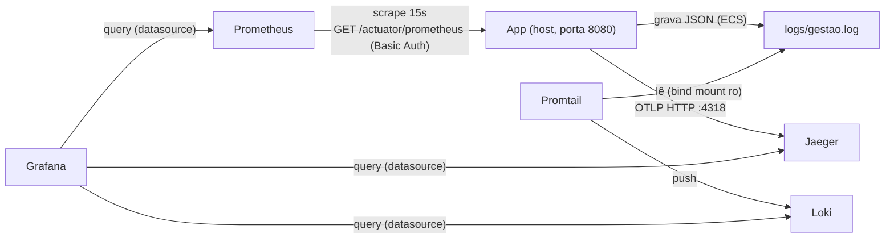
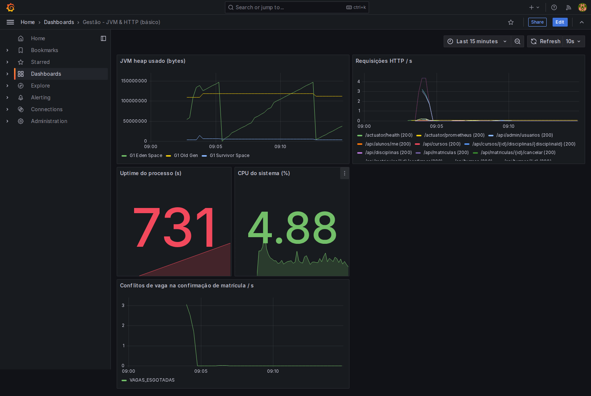
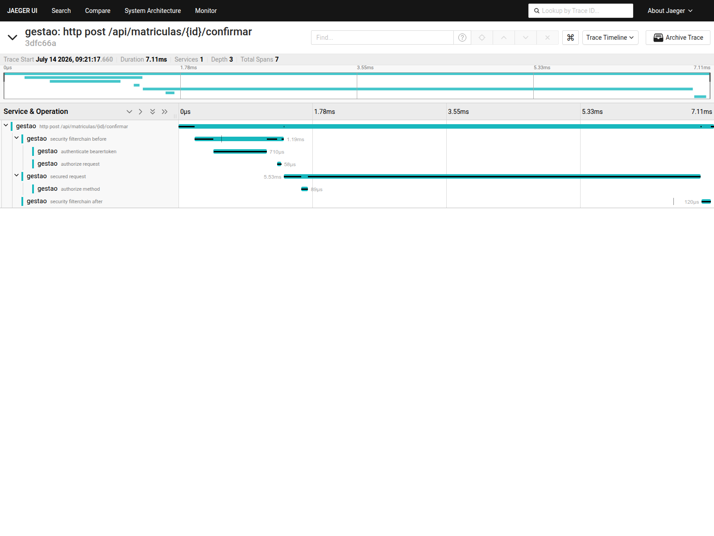

# Observabilidade

Este documento é o aprofundamento da seção `## Observabilidade` do [README](../README.md): explica, em
linguagem direta, o papel de cada componente da stack (Prometheus, Grafana, Loki, Promtail, Jaeger), como
cada um funciona por dentro, como eles se conectam entre si e o que olhar primeiro em cada UI. Para
comandos de subida (`docker compose --profile observability up -d`), a tabela de URLs/credenciais e a
lista de endpoints do Actuator, veja o README — este arquivo não repete essa parte operacional.

Todos os componentes fazem parte do profile `observability` do `compose.yaml` (D008) — não sobem no
`docker compose up` do dia a dia.

## Visão geral: como os componentes se conectam

Resumo em texto: a app roda **fora** do compose, no host (D003), então dois componentes precisam
"alcançar" a app em vez do contrário — Prometheus faz scrape do host via `host.docker.internal`, e
Promtail lê um arquivo de log montado como bind mount somente-leitura (`./logs:/var/log/gestao:ro`),
não via driver de container do Docker (D003/D017). Traces vão da app para o Jaeger via OTLP. Grafana não
recebe nada diretamente da app — ele só consulta os três backends (Prometheus, Loki, Jaeger) como
datasources, ao vivo, quando alguém abre um dashboard ou o Explore.

---

## Prometheus

**Papel:** cobre o sinal de **métricas** (séries temporais numéricas — contadores, gauges, histogramas):
uso de heap da JVM, requisições HTTP/s, CPU, uptime, e a métrica de negócio
`matricula_vaga_conflito_total` (D052).

**Como funciona:** modelo **pull**, não push. A cada 15s (`global.scrape_interval` em
`docker/prometheus/prometheus.yml`), o Prometheus faz uma requisição HTTP para
`GET /actuator/prometheus` da aplicação e lê o corpo (métricas no formato de texto do Prometheus/OpenMetrics).
Ele mesmo decide quando buscar — a aplicação não empurra nada proativamente. As séries coletadas ficam
armazenadas **localmente**, no volume do próprio container Prometheus (séries temporais indexadas por
nome de métrica + labels).

**Como se conecta:** como a aplicação roda no host, fora do compose (D003), o job `gestao-app` em
`docker/prometheus/prometheus.yml` aponta para `host.docker.internal:8080` em vez de um nome de serviço
do compose. O endpoint `/actuator/prometheus` é protegido por HTTP Basic Auth (usuário `prometheus`,
senha `PROMETHEUS_SCRAPE_PASSWORD`) — a credencial de scrape configurada no job precisa bater com
`spring.security.user.*` em `application.properties`. Grafana consulta o Prometheus como datasource
(`http://prometheus:9090`, via rede interna do compose — não confundir com a URL pública
`localhost:${PROMETHEUS_PORT:-9090}`).

**URL local + credenciais:** `http://localhost:${PROMETHEUS_PORT:-9090}` — sem login na própria UI do
Prometheus (uso local/desenvolvimento).

**O que olhar primeiro:** na aba "Graph", rodar a query `matricula_vaga_conflito_total` (métrica nova,
D052 — conta tentativas de confirmar matrícula que esbarraram em vaga esgotada, com tag `motivo`) ou
`http_server_requests_seconds_count` para ver o volume de requisições HTTP por rota/status.

---

## Grafana

**Papel:** é a camada de **visualização** — não cobre um sinal específico, é onde métricas, logs e traces
se encontram numa mesma UI.

**Como funciona:** Grafana **não armazena dado nenhum**. Ele só guarda a definição dos dashboards e das
datasources (provisionadas via arquivo, não criadas manualmente — `docker/grafana/provisioning/`); toda
vez que um painel é renderizado, ele consulta a datasource correspondente ao vivo.

**Como se conecta:** três datasources provisionadas em
`docker/grafana/provisioning/datasources/datasources.yml`, todas via rede interna do compose (`access:
proxy`):
- **Prometheus** (`http://prometheus:9090`, datasource padrão/`isDefault`).
- **Jaeger** (`http://jaeger:16686`).
- **Loki** (`http://loki:3100`), com um `derivedFields` configurado: uma regex (`traceId":"(\w+)"`) que
  procura um `traceId` no **conteúdo** da linha de log e, se encontrar, gera um link clicável para aquele
  trace no Jaeger. É esse `derivedFields` — e não um header AMQP ou qualquer mecanismo de propagação de
  mensageria — que faz a correlação log↔trace na UI (ver seção dedicada mais abaixo).

Um dashboard já vem provisionado: **"Gestão - JVM & HTTP (básico)"** (uid `gestao-jvm-http`,
`docker/grafana/provisioning/dashboards/jvm-http-dashboard.json`), pronto sem nenhuma configuração manual.

**URL local + credenciais:** `http://localhost:${GRAFANA_PORT:-3000}`, login
`GRAFANA_ADMIN_USER`/`GRAFANA_ADMIN_PASSWORD` (definidos no `.env`).

**O que olhar primeiro:** abrir o dashboard **"Gestão - JVM & HTTP (básico)"** e ir direto ao **painel 5,
"Conflitos de vaga na confirmação de matrícula / s"** — plota
`sum(rate(matricula_vaga_conflito_total{application="gestao"}[1m])) by (motivo)`, a métrica de negócio
mais nova do projeto (D052) e a única, hoje, que expõe diretamente a regra crítica de vagas em um gráfico.
Os outros quatro painéis (heap, requisições HTTP/s, uptime, CPU) são infraestrutura básica da JVM/HTTP.
Depois, vale abrir o **Explore** apontando para o datasource Loki para ver logs ao vivo e testar o link
para o Jaeger via `derivedFields`.

Evidência do dashboard provisionado renderizando dado real, não vazio: heap da JVM, requisições HTTP/s por
endpoint, uptime, CPU% e, no painel 5, o `matricula.vaga.conflito` com valores não-zero coletados de uma
disputa de vaga disparada de propósito.

---

## Loki

**Papel:** cobre o sinal de **logs** — armazena e permite consultar as linhas de log estruturado emitidas
pela aplicação.

**Como funciona:** Loki indexa **só os labels**, não o conteúdo da linha de log. O conteúdo completo (a
linha JSON inteira, formato ECS) fica salvo em chunks no filesystem
(`common.storage.filesystem.chunks_directory` em `docker/loki/loki-config.yaml`), fora do índice. Isso
significa que buscar por um label (ex: `level="ERROR"`) é uma consulta indexada e rápida, mas buscar por
um texto livre dentro da linha (ex: um `traceId` específico) é uma varredura sobre o conteúdo dos chunks —
por isso essa consulta acontece via **Grafana Explore** com LogQL, não por uma UI própria do Loki (Loki
não tem UI). Recebe as linhas via **push** do Promtail, não faz scrape de nada.

**Como se conecta:** exposto na rede interna do compose em `http://loki:3100`; Promtail envia (push) para
`http://loki:3100/loki/api/v1/push`; Grafana consulta como datasource (`http://loki:3100`, `access:
proxy`).

**URL local + credenciais:** nenhuma — Loki não expõe UI própria nem porta pública documentada para uso
direto. É acessado exclusivamente via Grafana Explore.

**O que olhar primeiro:** no Grafana Explore, selecionar o datasource Loki e rodar `{job="gestao-app"}`
para ver o stream de logs da aplicação; filtrar por `{job="gestao-app", level="ERROR"}` para isolar erros.
Repare que `level` é o único label extraído do JSON (ver Promtail abaixo) — qualquer outro campo
(`traceId`, `message`, etc.) só é pesquisável como texto livre dentro da linha, não como label.

---

## Promtail

**Papel:** é o **agente coletor de logs** — a ponte entre o arquivo de log da aplicação e o Loki. Não
armazena nada de forma persistente além de um ponteiro de posição de leitura.

**Como funciona:** lê o arquivo `logs/gestao.log` no host, montado no container como bind mount
somente-leitura (`./logs:/var/log/gestao:ro` no `compose.yaml`) — uma ponte de **arquivo**, não o driver
de log de container do Docker, porque a aplicação roda fora do compose, no host (D003/D017). Cada linha é
JSON (formato ECS); o `pipeline_stages` em `docker/promtail/promtail-config.yaml` faz o parse e extrai
**somente `level`** como label indexado no Loki — deliberadamente **não** `trace_id`/`span_id`. Essa
omissão é intencional (D017): `trace_id`/`span_id` têm um valor novo por requisição (alta cardinalidade),
e como endpoints públicos como `/actuator/health` e `/actuator/prometheus` não exigem autenticação,
qualquer cliente poderia gerar volume suficiente de valores únicos para inflar sem limite o índice do
Loki (um vetor de negação de serviço). A correlação log→trace não depende desse label — ela usa
`derivedFields` no Grafana, uma regex sobre o conteúdo da linha (ver seção do Grafana).

**Como se conecta:** lê o arquivo local (`/var/log/gestao/*.log` dentro do container, via o bind mount);
envia (push) as linhas processadas para `http://loki:3100/loki/api/v1/push`.

**URL local + credenciais:** não expõe UI nem porta de uso direto — é um agente que roda em background.

**O que olhar primeiro:** não há UI própria; a forma de verificar que o Promtail está funcionando é olhar
os logs do próprio container (`docker compose logs promtail`) ou simplesmente confirmar que novas linhas
aparecem no Grafana Explore ao consultar `{job="gestao-app"}` no Loki.

---

## Jaeger

**Papel:** cobre o sinal de **tracing distribuído** — mostra, para uma requisição individual, a árvore de
spans (chamadas HTTP, métodos de serviço, publicação de eventos) e quanto tempo cada etapa levou.

**Como funciona:** recebe traces via **OTLP** (OpenTelemetry Protocol), não o protocolo legado/proprietário
do Jaeger. O `compose.yaml` habilita isso explicitamente
(`COLLECTOR_OTLP_ENABLED=true` no serviço `jaeger`, imagem `jaegertracing/all-in-one:1.60`), expondo a
porta OTLP/HTTP `4318` (também expõe `4317`/OTLP-gRPC, mas a aplicação usa a variante HTTP). Do lado da
aplicação, `management.otlp.tracing.endpoint` aponta para essa porta, e
`management.tracing.sampling.probability=1.0` significa amostragem de **100%** — todo request gera um
trace completo (aceitável no volume de um desafio técnico; em produção real seria tipicamente reduzido).

**Como se conecta:** a aplicação envia spans diretamente ao Jaeger via OTLP HTTP (`:4318`); Grafana
consulta o Jaeger como datasource (`http://jaeger:16686`) tanto para exibir o painel de busca de traces
quanto para resolver os links gerados pelo `derivedFields` do Loki.

**URL local + credenciais:** `http://localhost:${JAEGER_UI_PORT:-16686}` — sem login.

**O que olhar primeiro:** na busca ("Search"), selecionar o serviço `gestao` e procurar um trace de
`POST /api/matriculas/{id}/confirmar` — esse é o fluxo mais ilustrativo porque mostra a árvore completa de
spans: a camada HTTP (controller), a camada de domínio/serviço (onde a regra de vaga é avaliada) e a
publicação do evento de domínio via Spring Modulith.

Evidência de um trace real (não a tela de busca/comparação) para `POST /api/matriculas/{id}/confirmar`,
expandido: 7 spans, 7,11ms de duração, profundidade 3 (filterchain de segurança → autenticação do bearer
token → autorização de request/method → requisição segura) — mostra o tracing distribuído funcionando de
ponta a ponta na requisição síncrona.

---

## Correlação log ↔ trace ↔ mensageria

Duas correlações diferentes existem no projeto e é fácil confundi-las:

1. **Log → trace (dentro do request síncrono):** funciona automaticamente. A aplicação grava `trace_id`/
   `span_id` no log via MDC (populado pelo Micrometer Tracing durante o request). No Grafana Explore, o
   `derivedFields` do datasource Loki (`docker/grafana/provisioning/datasources/datasources.yml`) casa a
   regex `traceId":"(\w+)"` contra o **conteúdo** da linha de log — não contra um label — e gera um link
   direto para aquele trace no Jaeger.
2. **Trace através da mensageria assíncrona (RabbitMQ/Modulith):** **não** funciona automaticamente. A
   propagação nativa de trace do Spring Boot/AMQP (`observation-enabled`) foi avaliada e não atravessa a
   externalização assíncrona de eventos do Spring Modulith, porque essa publicação roda numa thread
   separada da requisição original — comportamento verificado empiricamente, não apenas suposto (ver
   [D034](DECISIONS.md#d034) para o raciocínio completo e as alternativas descartadas). Por isso o
   `traceId` viaja **manualmente como um campo no payload do evento** (não como header AMQP), para que o
   consumidor do evento consiga logar com o mesmo `trace_id` do fluxo original — mas isso não gera um
   único trace unificado no Jaeger atravessando o broker, é uma correlação só ao nível de log.

## Referências

- `compose.yaml` — definição dos serviços do profile `observability`.
- `docker/prometheus/prometheus.yml` — job de scrape.
- `docker/grafana/provisioning/datasources/datasources.yml` — datasources e `derivedFields`.
- `docker/grafana/provisioning/dashboards/jvm-http-dashboard.json` — dashboard "Gestão - JVM & HTTP
  (básico)".
- `docker/promtail/promtail-config.yaml` — pipeline de parsing/labels.
- `docker/loki/loki-config.yaml` — armazenamento e schema.
- [`docs/DECISIONS.md`](DECISIONS.md) — D003 (app fora do compose), D008 (profile `observability`), D009
  (dashboard provisionado), D017 (bind mount de log + não indexar trace_id/span_id), D034 (propagação de
  trace via payload, não header AMQP), D052 (métrica `matricula.vaga.conflito`).
