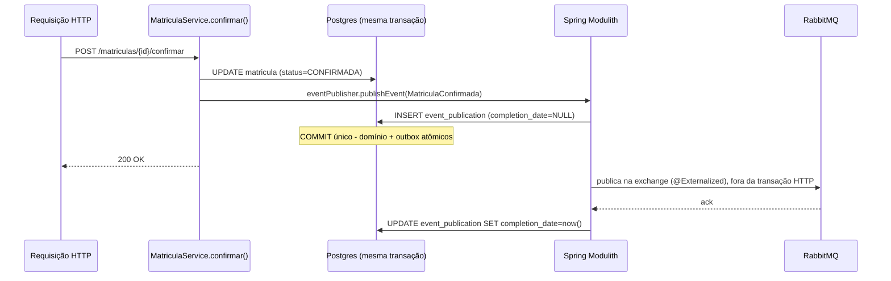

# Finalização (Fase 7) — Implementation Plan

> **For agentic workers:** REQUIRED SUB-SKILL: Use superpowers:subagent-driven-development (recommended) or superpowers:executing-plans to implement this plan task-by-task. Steps use checkbox (`- [ ]`) syntax for tracking.

**Goal:** Fechar as lacunas de documentação/evidência que faltam para o desafio ser avaliado com
segurança: documento arquitetural curto (PRD §04), observabilidade explicada, evidência visual de ponta a
ponta, checklist literal do PRD §06/§08 com evidência real, e material de entrevista consolidado. Sem
funcionalidade nova.

**Architecture:** Documentação pura (`docs/ARQUITETURA.md`, `docs/OBSERVABILIDADE.md`) + correções de
consistência em arquivos já existentes (`README.md`, `specs/010`) + evidências visuais (`docs/images/`,
capturadas por um subagent com Playwright/browser real, sessão única e descartável, D054).

**Tech Stack:** Markdown + Mermaid (diagramas nativos do GitHub), Spring Modulith `Documenter` (saída
`.puml` comitada como texto, D056), Playwright com browser real só para a sessão de captura (fora de
`e2e/playwright/`, que continua sem browser, D049).

**Numeração das tasks:** este plano começa na Task 2 porque a Task 1 (spec 013 + decisões D054-D056) já foi
concluída nesta sessão, fora deste arquivo — `specs/013-finalizacao.md` está aprovada e `docs/DECISIONS.md`
já tem D054-D056 confirmados. Numeração 2-9 mantida para bater com as referências já escritas na spec.

## Global Constraints

- Nenhuma mudança de código de produção nesta fase (exceto a extensão de teste do `Documenter`, que é
  test-only).
- Ordem de execução é fixa (prescrita pelo Pablo, não reordenar): 2 (ARQUITETURA.md) → 3
  (OBSERVABILIDADE.md) → 4 (consistência) → 5 (checklist PRD) → 6 (gate + captura) → 7 (evidências no
  README) → 8 (Uso de IA) → 9 (pitch + fechamento).
- `docs/ARQUITETURA.md` e `docs/OBSERVABILIDADE.md` **narram e linkam** para `docs/DECISIONS.md` — não
  reescrevem o conteúdo das decisões já registradas lá.
- Diagramas narrativos (visão geral de módulos, fluxo do outbox) em **Mermaid manual** dentro do markdown
  (renderiza nativamente no GitHub). O diagrama gerado pelo `Documenter` do Modulith é evidência
  complementar, comitado como texto `.puml` em `docs/architecture/modules.puml` — não é renderizado (D056).
- Captura de evidências visuais: subagent instala um browser real via Playwright **fora de
  `e2e/playwright/`** (ex: em `/tmp` ou num diretório de scratch próprio, nunca commitado como projeto Node
  novo) — sessão única, descartável, não entra no CI (D054). Evidências que já são texto por natureza
  (query em `event_publication`, saída do teste de concorrência) viram bloco de código no documento, nunca
  imagem.
- Toda imagem em `docs/images/` precisa de legenda explicando o que ela prova — imagem sem legenda não
  conta como evidência.
- Commits em português, estilo já usado no repo (`docs:`, `fix:`, `test:`, `chore:` + descrição curta).
- Nenhum item do checklist do PRD (spec 013 §6) pode ser marcado `[x]` sem evidência real apontada
  (arquivo/seção/teste/imagem) — nunca "assumir que está ok".

---

### Task 2: `docs/ARQUITETURA.md` — documento arquitetural curto com seção dedicada de outbox (prioridade 1)

**Files:**
- Create: `docs/ARQUITETURA.md`
- Create: `docs/architecture/modules.puml` (saída do `Documenter` do Modulith)
- Modify: `src/test/java/br/com/desafio/tecnico/gestao/ModularidadeTest.java` (novo método gerando a
  documentação, não substitui o teste de verificação existente)

**Interfaces:**
- Consumes: `ApplicationModules.of(GestaoApplication.class)` (já usado em `ModularidadeTest.java`),
  `org.springframework.modulith.docs.Documenter` (classe do `spring-modulith-starter-core`, já no
  classpath).
- Produces: `docs/ARQUITETURA.md`, referenciado pela Task 4 (link do README) e pela Task 9 (pitch de
  entrevista aponta pra seções específicas deste documento).

- [ ] **Step 1: Estender `ModularidadeTest.java` com um método que gera a documentação do `Documenter`**

Adicione ao arquivo existente (não remova o teste `modulosRespeitamOsLimitesDeEncapsulamento`):

```java
package br.com.desafio.tecnico.gestao;

import org.junit.jupiter.api.Test;
import org.springframework.modulith.core.ApplicationModules;
import org.springframework.modulith.docs.Documenter;

/**
 * specs/006-matricula.md, seção 4.3: primeira vez que o projeto tem mais de um módulo
 * com interação real entre eles (academico -> notificacao, via eventos de domínio,
 * D029). ApplicationModules.verify() reforça em tempo de teste os limites entre
 * módulos definidos pela estrutura de pacotes (CLAUDE.md, "Arquitetura-alvo") - falha
 * se algum código referenciar um tipo interno (subpacote) de outro módulo em vez de
 * usar sua API pública (pacote raiz) ou eventos.
 */
class ModularidadeTest {

	@Test
	void modulosRespeitamOsLimitesDeEncapsulamento() {
		ApplicationModules.of(GestaoApplication.class).verify();
	}

	/**
	 * specs/013-finalizacao.md, D056: gera a saída PlantUML do Documenter do Modulith -
	 * evidência automática de que a modularização declarada em docs/ARQUITETURA.md é a
	 * real, derivada do mesmo ApplicationModules usado por verify() acima. Não é um
	 * teste de asserção (sem @Test de verificação) - roda uma vez, manualmente, para
	 * gerar o artefato comitado em docs/architecture/. Não faz parte do gate de CI
	 * (não precisa rodar a cada build; o diagrama só muda se a estrutura de módulos
	 * mudar).
	 */
	@Test
	void geraDocumentacaoDeModulos() {
		new Documenter(ApplicationModules.of(GestaoApplication.class)).writeModulesAsPlantUml();
	}

}
```

- [ ] **Step 2: Rodar o método e localizar o `.puml` gerado**

```bash
./mvnw test -Dtest=ModularidadeTest#geraDocumentacaoDeModulos
find . -name "*.puml" -newer pom.xml 2>/dev/null
```

Expected: o `Documenter` grava por padrão em `target/spring-modulith-docs/` (ex:
`target/spring-modulith-docs/module-academico.puml`, `module-notificacao.puml`, ou um `components.puml`
agregado — confirme o nome exato gerado, pode variar por versão). Copie o(s) arquivo(s) relevante(s)
(prefira o diagrama de componentes agregado, que mostra a relação entre os dois módulos, sobre os diagramas
individuais por módulo, se ambos forem gerados) para `docs/architecture/modules.puml`.

```bash
mkdir -p docs/architecture
cp target/spring-modulith-docs/<arquivo-encontrado>.puml docs/architecture/modules.puml
```

- [ ] **Step 3: Criar `docs/ARQUITETURA.md`**

Estrutura obrigatória (preencher com prosa real, não placeholder — os fatos abaixo já foram pesquisados e
são exatos, use-os):

```markdown
# Arquitetura — Gestão de Matrículas Acadêmicas

Documento curto, não é um substituto de `docs/DECISIONS.md` (fonte granular de 53+ decisões) — aqui está a
história arquitetural, com link pontual para profundidade quando precisar.

## Visão geral

Monólito modular via Spring Modulith: dois módulos top-level, `academico` (domínio de matrícula) e
`notificacao` (contexto secundário, reage a eventos). [Diagrama Mermaid da visão geral - dois módulos +
seta de evento entre eles].

Por quê monólito modular em vez de microsserviços desde o início: [D001](DECISIONS.md#d001) - o PRD pede
desacoplamento real e demonstrável, não múltiplos processos literais. Trade-off aceito: sem isolamento de
deploy entre os módulos; ganho real: `ApplicationModules.verify()` reforça o limite entre contextos em
tempo de teste (falha o build se `notificacao` importar um tipo interno de `academico` em vez de consumir
via evento) - ver `docs/architecture/modules.puml`, gerado automaticamente a partir do mesmo mecanismo.

## Decisões mais defensáveis

### D001 — Monólito modular vs. microsserviços
[resumir o trade-off real: custo de infra desproporcional ao ganho em 7 dias, vs. desacoplamento
verificável]

### D024/D053 — Estratégia de concorrência na regra de vagas
UPDATE condicional atômico + @Version (D024), não lock pessimista. Números reais da Fase 6 (specs/012):
prova e2e de 20 alunos disputando a última vaga, 20/20 execuções (2x --repeat-each=10) com exatamente 1
sucesso + 19 conflitos VAGAS_ESGOTADAS; comparação JVM N=10/M=1 - atômica e pessimista com corretude
idêntica (1 sucesso/9 conflitos/0 exceções cada), tempo estatisticamente indistinguível (32ms vs 33ms,
achado da revisão final: não é apples-to-apples, ver D053) - decisão final ([D053](DECISIONS.md#d053)):
manter a atômica, sem ganho demonstrado da pessimista para justificar a troca.

### D002 — RabbitMQ vs. Kafka
[resumir: simplicidade operacional para o escopo do desafio vs. réplica de log/Kafka, ver D002]

## Outbox: como funciona neste projeto (Spring Modulith Event Publication Registry)

**Por que outbox existe, em uma frase:** sem ele, salvar o estado da Matrícula no banco e publicar o
evento no RabbitMQ seriam duas escritas separadas ("dual write") - se a segunda falhar depois da primeira
ter sucesso, o evento se perde silenciosamente; o outbox garante que a publicação do evento é atômica com a
mudança de estado, porque as duas acontecem na mesma transação de banco.

**Por que isso não aparece como uma classe `OutboxPublisher` no código:** não existe nenhuma classe assim
neste projeto, nem uma tabela `outbox` criada à mão. O padrão inteiro é implementado pela infraestrutura do
Spring Modulith (`spring-modulith-starter-jpa` + `spring-modulith-events-amqp`) - quem não conhece o
framework não vai encontrar isso lendo o código de negócio, só a configuração.

**Fluxo concreto, passo a passo:**



1. `eventPublisher.publishEvent(...)` é chamado **dentro** do método `@Transactional` que muda o estado
   (`MatriculaService.criar()`/`confirmar()`/`cancelar()`) - mesma transação, mesmo commit/rollback.
2. `spring-modulith-starter-jpa` (auto-configurado, sem bean explícito) grava uma linha em
   `event_publication` (schema em `src/main/resources/db/migration/V8__infraestrutura_criar_tabela_event_publication.sql`,
   copiado literalmente do schema do `spring-modulith-events-jdbc`) com `completion_date IS NULL` - isso é
   o outbox.
3. Cada record de evento (`MatriculaCriada`, `MatriculaConfirmada`, `MatriculaCancelada`, em
   `src/main/java/br/com/desafio/tecnico/gestao/academico/`) leva a anotação
   `@Externalized(MensageriaConfig.EXCHANGE_EVENTOS + "::" + <routing key>)` - é essa anotação, sozinha, que
   faz o `spring-modulith-events-amqp` publicar o evento no RabbitMQ depois do commit, sem nenhum código de
   dispatcher escrito à mão.
4. Se a entrega tiver sucesso, `event_publication.completion_date` é marcado. Se falhar (broker fora do ar,
   por exemplo), a linha continua com `completion_date IS NULL`.
5. A property `spring.modulith.events.republish-outstanding-events-on-restart=true`
   (`src/main/resources/application.properties:63`) faz a aplicação reconsultar `event_publication` por
   linhas incompletas no próximo start e reenviar - prova disso, com o RabbitMQ deliberadamente parado, em
   `src/test/java/br/com/desafio/tecnico/gestao/notificacao/OutboxReenvioIntegrationTest.java`.

**Mapa "onde está no código":**

| Peça | Arquivo |
|---|---|
| Publicação (dentro da transação) | `academico/service/MatriculaService.java` (`criar()`/`confirmar()`/`cancelar()`) |
| Records de evento + `@Externalized` | `academico/MatriculaCriada.java`, `MatriculaConfirmada.java`, `MatriculaCancelada.java` |
| Schema da tabela outbox | `db/migration/V8__infraestrutura_criar_tabela_event_publication.sql` |
| Reenvio após restart | `application.properties:59-63` (`republish-outstanding-events-on-restart`) |
| Prova de reenvio | `notificacao/OutboxReenvioIntegrationTest.java` |
| Topologia RabbitMQ (exchange/filas/DLQ) | `config/MensageriaConfig.java` |
| Consumidor + idempotência | `notificacao/MatriculaNotificacaoListener.java`, tabela `evento_processado` (V9) |

**O que se ganha "de graça" vs. um outbox artesanal:** zero código de dispatcher/relay, reentrega
automática após restart, sem tabela nem lógica de retry escritas à mão. **Limitações aceitas:** reenvio só
acontece no restart da aplicação (não é um relay contínuo tipo Debezium/CDC monitorando a tabela em tempo
real) - para este escopo é suficiente; se a exigência fosse "reenviar em segundos, sem esperar restart",
seria hora de revisitar.

Decisões relacionadas: [D029](DECISIONS.md#d029) (eventos internos primeiro, RabbitMQ depois),
[D032](DECISIONS.md#d032) (topic exchange), [D033](DECISIONS.md#d033) (retry/DLQ),
[D034](DECISIONS.md#d034) (trace ID - por que a propagação nativa não bastou),
[D035](DECISIONS.md#d035) (eventId/idempotência/topologia).

## Riscos conhecidos aceitos

[Varrer docs/DECISIONS.md por "risco conhecido"/"aceito" e resumir os 3-5 mais relevantes: rede do compose
sem mTLS entre serviços (D035), credenciais dev-only documentadas, qualquer achado de security-auditor
mantido deliberadamente.]

## Caminho de evolução

Como `academico` e `notificacao` se extrairiam como serviços separados se necessário: [responder a
pergunta literal do PRD §09 - "como você separaria esse módulo em outro serviço?" - já que os dois módulos
só se comunicam por evento publicado (nunca chamada síncrona direta), a extração é principalmente trocar o
transporte do evento (já é RabbitMQ) e mover o consumidor para um processo separado - o desacoplamento já
existe, falta só o segundo `docker run`].

## Tratamento de falhas de mensageria (resumo)

[Resumir sem duplicar a seção de outbox acima: retry 3x/10s fixo, DLQ nativa do RabbitMQ, idempotência via
`evento_processado` (dedupe por eventId) - ver D033/D035 para os números e alternativas consideradas.]
```

- [ ] **Step 4: Verificar que os links relativos para `docs/DECISIONS.md` resolvem corretamente**

```bash
grep -o "](DECISIONS.md#d[0-9]*)" docs/ARQUITETURA.md | sort -u
```

Para cada âncora encontrada, confirme que existe uma entrada correspondente em `docs/DECISIONS.md` (`grep
"^## D0XX"`).

- [ ] **Step 5: Commit**

```bash
git add docs/ARQUITETURA.md docs/architecture/modules.puml src/test/java/br/com/desafio/tecnico/gestao/ModularidadeTest.java
git commit -m "docs: cria docs/ARQUITETURA.md com secao dedicada de outbox via Spring Modulith (specs/013)"
```

---

### Task 3: `docs/OBSERVABILIDADE.md` + resumo no README (prioridade 2)

**Files:**
- Create: `docs/OBSERVABILIDADE.md`
- Modify: `README.md` (seção `## Observabilidade`, linhas 191-224 na versão atual)

**Interfaces:**
- Consumes: nenhum artefato de outra task.
- Produces: `docs/OBSERVABILIDADE.md`, referenciado pela Task 4 (link na seção `## Documentação` do
  README).

- [ ] **Step 1: Criar `docs/OBSERVABILIDADE.md`**

Uma subseção por componente real do `compose.yaml` (perfil `observability`): Prometheus, Grafana, Loki,
Promtail, Jaeger. Para cada um: **Papel** (que sinal cobre), **Como funciona** (pull vs. push, o que
armazena), **Como se conecta** aos outros, **URL local + credenciais**, **O que olhar primeiro**. Fatos
exatos a usar (já pesquisados, não inventar):

- **Prometheus** (`docker/prometheus/prometheus.yml`): modelo **pull** - faz scrape a cada 15s do endpoint
  `/actuator/prometheus` (job `gestao-app`, `host.docker.internal:8080` porque a app roda no host, D003),
  autenticado via Basic Auth (usuário `prometheus`, senha `PROMETHEUS_SCRAPE_PASSWORD`). Armazena as séries
  temporais localmente. URL: `http://localhost:${PROMETHEUS_PORT:-9090}`, sem credencial de UI. Olhar
  primeiro: a query `matricula_vaga_conflito_total` (métrica nova da Fase 6, D052) ou
  `http_server_requests_seconds_count`.
- **Grafana** (`docker/grafana/provisioning/`): não armazena nada - só consulta as 3 datasources
  provisionadas (Prometheus, Jaeger, Loki, ver `datasources.yml`) e renderiza. URL:
  `http://localhost:${GRAFANA_PORT:-3000}`, login `GRAFANA_ADMIN_USER`/`GRAFANA_ADMIN_PASSWORD`. Olhar
  primeiro: dashboard "Gestão - JVM & HTTP (básico)" (uid `gestao-jvm-http`), painel 5 "Conflitos de vaga
  na confirmação de matrícula / s" (**hoje não documentado em nenhum lugar - inclua explicitamente**).
- **Loki** (`docker/loki/loki-config.yaml`): armazena só os **labels** indexados (não o conteúdo da linha
  de log, que fica no filesystem) - por isso a consulta por texto livre é via Grafana Explore, não uma UI
  própria (Loki não tem UI). Recebe via push do Promtail (`http://loki:3100/loki/api/v1/push`). Sem URL
  direta de UI - acessado só via Grafana Explore.
- **Promtail** (`docker/promtail/promtail-config.yaml`): lê o arquivo `logs/gestao.log` (bind mount
  `./logs:/var/log/gestao:ro` - ponte de arquivo, não driver de container, porque a app roda no host, D003
  e D017), faz parse do JSON (formato ECS) extraindo só `level` como label (deliberadamente **não**
  `trace_id`/`span_id`, por risco de cardinalidade/DoS via endpoint público, D017) e envia pro Loki.
- **Jaeger** (`compose.yaml`, `jaegertracing/all-in-one`): recebe traces via **OTLP** (não o protocolo
  legado do Jaeger), porta HTTP `4318` (`management.otlp.tracing.endpoint` na app), amostragem 100%
  (`management.tracing.sampling.probability=1.0`). URL: `http://localhost:${JAEGER_UI_PORT:-16686}`, sem
  login. Olhar primeiro: buscar por serviço `gestao` e abrir o trace de um `POST /api/matriculas/{id}/confirmar`
  - mostra os spans HTTP → domínio → publicação Modulith.

**Como se conectam (resumo em texto ou mini-diagrama Mermaid):** app → (scrape) Prometheus; app → arquivo
`logs/gestao.log` → Promtail → Loki; app → OTLP HTTP → Jaeger; Grafana → consulta as 3 (Prometheus/Loki/Jaeger)
via rede do compose. No Grafana Explore, uma linha de log com `traceId` tem link direto (`derivedFields`,
regex sobre o conteúdo) para o trace correspondente no Jaeger - essa é a correlação log↔trace.

**Correlação com trace ID na mensageria:** a propagação nativa do Spring Boot/AMQP (`observation-enabled`)
não atravessa a externalização assíncrona do Modulith (thread separada) - verificado empiricamente, ver
[D034](DECISIONS.md#d034). O `traceId` viaja manualmente como campo no payload do evento, não como header
AMQP.

- [ ] **Step 2: Reduzir a seção `## Observabilidade` do README para resumo + link**

Leia o `README.md` completo primeiro para confirmar que a seção ainda está nas linhas indicadas (pode ter
mudado com commits recentes). Substitua o corpo detalhado por algo como:

```markdown
## Observabilidade

A stack completa (Prometheus, Grafana, Jaeger, Loki, Promtail) sobe com
`docker compose --profile observability up -d` (D008). Todas as UIs ficam restritas a `127.0.0.1`.

| Ferramenta | URL | Credenciais |
|---|---|---|
| Grafana | `http://localhost:${GRAFANA_PORT:-3000}` | `GRAFANA_ADMIN_USER`/`GRAFANA_ADMIN_PASSWORD` (`.env`) |
| Prometheus | `http://localhost:${PROMETHEUS_PORT:-9090}` | nenhuma (uso local) |
| Jaeger UI | `http://localhost:${JAEGER_UI_PORT:-16686}` | nenhuma (uso local) |
| Loki | sem UI própria — consultado via Grafana Explore | — |

Explicação de papel/funcionamento/conexão de cada componente, incluindo o painel de negócio
`matricula.vaga.conflito` (D052) e como logs/traces se correlacionam: **[docs/OBSERVABILIDADE.md](docs/OBSERVABILIDADE.md)**.

**Actuator exposto:**
- `GET /actuator/health` — público, sem autenticação.
- `GET /actuator/prometheus` — protegido por HTTP Basic Auth (usuário `prometheus`, senha em
  `PROMETHEUS_SCRAPE_PASSWORD`).
```

Preserve qualquer conteúdo que ainda for exclusivamente operacional (não duplicado no novo doc) se, ao ler
o README atual, algo relevante for perdido nessa redução — usar bom senso, o objetivo é resumo+link, não
apagar informação prática de "como rodar".

- [ ] **Step 3: Commit**

```bash
git add docs/OBSERVABILIDADE.md README.md
git commit -m "docs: cria docs/OBSERVABILIDADE.md, README passa a resumir e linkar (specs/013, D055)"
```

---

### Task 4: Consistência README/ROADMAP/DECISIONS/specs (prioridade 4)

**Files:**
- Modify: `specs/010-administracao-usuarios-papeis.md` (linha 3, `Status`)
- Modify: `README.md` (banner de status, topo; seção `## Documentação`)
- Verify only: `docs/DECISIONS.md`, `docs/ROADMAP.md` (sem mudança esperada, só conferência)
- Track: `docs/superpowers/plans/2026-07-12-administracao-usuarios-papeis.md`,
  `docs/superpowers/plans/2026-07-13-tema-keycloakify-login.md`

**Interfaces:**
- Consumes: `docs/ARQUITETURA.md` e `docs/OBSERVABILIDADE.md` (criados nas Tasks 2/3 — precisam existir
  para linkar).
- Produces: nenhum artefato novo consumido por outra task.

- [ ] **Step 1: Corrigir o Status de `specs/010-administracao-usuarios-papeis.md`**

```bash
grep -n "^\*\*Status:\*\*" specs/010-administracao-usuarios-papeis.md
```

Troque `**Status:** \`aprovada\`` por `**Status:** \`concluída\`` (linha 3) — confirmado como stale nesta
pesquisa: `docs/ROADMAP.md` e `.superpowers/sdd/progress.md` já tratam a spec 010 como concluída desde
2026-07-13.

- [ ] **Step 2: Reescrever o banner de status no topo do `README.md`**

Leia as linhas atuais (originalmente 7-11, confirme antes de editar) — hoje dizem algo como "Pendente:
consolidar o documento arquitetural curto de entrevista sobre a estratégia final de concorrência". Essa
pendência está sendo resolvida por esta própria fase (Tasks 2-9). Reescreva para não prometer algo que já
estará pronto quando esta task fechar — por exemplo, remova a menção a "pendente" e substitua por uma frase
neutra referenciando `docs/ARQUITETURA.md` e `docs/ROADMAP.md` para o estado atual, sem data de expiração
embutida no texto.

- [ ] **Step 3: Linkar os novos artefatos na seção `## Documentação` do README**

Adicione `docs/ARQUITETURA.md` e `docs/OBSERVABILIDADE.md` à lista de documentos já linkados nessa seção
(junto com `docs/DECISIONS.md`, `docs/ROADMAP.md`, `PRD.md`, se já estiverem lá — confira a lista atual
antes de editar).

- [ ] **Step 4: Reconferir consistência de `docs/DECISIONS.md`**

```bash
echo "Índice: $(grep -c '^\- \[D[0-9]\{3\} —' docs/DECISIONS.md)"
echo "Corpo:  $(grep -c '^## D[0-9]\{3\} —' docs/DECISIONS.md)"
```

Expected: os dois números batem (56, incluindo D054-D056 desta fase). Se não baterem, investigue e
corrija antes de prosseguir — não é esperado achar problema aqui pela pesquisa já feita, mas confirme.

- [ ] **Step 5: Commitar os 2 arquivos de plano ainda não rastreados**

```bash
git status --short docs/superpowers/plans/
git add docs/superpowers/plans/2026-07-12-administracao-usuarios-papeis.md \
        docs/superpowers/plans/2026-07-13-tema-keycloakify-login.md
```//continua no commit do Step 6, junto com o resto desta task

- [ ] **Step 6: Conferir `docs/ROADMAP.md`**

Leia a tabela "Fases restantes" e confirme que nenhuma fase aparece como "Concluída" sem justificativa —
pela pesquisa já feita, não deveria haver nada a corrigir aqui. A Fase 7 continua "Pendente" até a Task 9
(último passo deste plano) — não marque como concluída agora.

- [ ] **Step 7: Commit**

```bash
git add specs/010-administracao-usuarios-papeis.md README.md
git commit -m "fix: corrige inconsistencias README/specs encontradas na revisao da Fase 7 (specs/013)"
```

(Os 2 arquivos de plano do Step 5 já foram adicionados ao stage — vão juntos neste commit, ou num commit
separado se preferir manter o housekeeping isolado do fix de conteúdo; qualquer uma das duas formas é
aceitável, escolha a que ficar mais clara no log.)

---

### Task 5: Checklist literal do PRD com evidência (prioridade 5, pode revelar retrabalho)

**Files:**
- Modify: `specs/013-finalizacao.md` (seção 6 — marcar `[x]` item por item com evidência)

**Interfaces:**
- Consumes: `docs/ARQUITETURA.md`, `docs/OBSERVABILIDADE.md` (Tasks 2/3), correções da Task 4 — todos já
  existem quando esta task roda.
- Produces: nenhum artefato novo — o output é a spec 013 §6 preenchida, e um relatório de lacunas (se
  houver) para o controlador decidir o que fazer.

- [ ] **Step 1: Percorrer cada item da seção 6 de `specs/013-finalizacao.md` (PRD §04, §05, §06, §07, §08)**

Para cada linha, aponte a evidência real: caminho de arquivo, número de seção/linha, nome de teste, ou
"print da Task 6" (referenciado pelo nome de arquivo esperado em `docs/images/`, mesmo que a imagem ainda
não exista fisicamente — a Task 6 vem depois na ordem prescrita, então o nome do arquivo é uma promessa a
cumprir, não uma mentira). Edite cada `- [ ]` para `- [x] <descrição> — evidência: <caminho/seção/teste>`.

- [ ] **Step 2: Reportar qualquer item sem evidência real**

Se, ao percorrer a lista, algum item genuinamente não tiver como ser marcado com evidência real (não
"acho que está ok"), **não marque como concluído e não documente como "trade-off consciente" para evitar
trabalho**. Liste esses itens explicitamente no relatório desta task, priorizados por serem os itens do
PRD §06 (critérios eliminatórios) — esses são os mais graves. O controlador decide o que fazer com cada
lacuna encontrada (pode virar uma correção pontual antes da Task 6, ou uma nota honesta na seção de riscos
do `docs/ARQUITETURA.md`, dependendo da gravidade — não decidir isso sozinho, escalar).

- [ ] **Step 3: Commit**

```bash
git add specs/013-finalizacao.md
git commit -m "docs: preenche checklist literal do PRD com evidencia (specs/013)"
```

---

### Task 6: Gate e2e completo + sessão de captura de evidências (prioridade 6)

**Files:**
- Create: `docs/images/*.png` (múltiplos arquivos — nomes descritivos, ex: `login-keycloak.png`,
  `matricula-fluxo-angular.png`, `admin-usuarios-papeis.png`, `grafana-dashboard.png`, `jaeger-trace-matricula.png`,
  `rabbitmq-management-filas-dlq.png`, `swagger-ui.png`)

**Interfaces:**
- Consumes: ambiente completo (compose + app + frontend) já validado pelas fases anteriores.
- Produces: as imagens em `docs/images/`, consumidas pela Task 7 (embutidas com legenda).

- [ ] **Step 1: Gate de backend**

```bash
./mvnw clean verify
```

Expected: BUILD SUCCESS, JaCoCo gate ≥80% mantido.

- [ ] **Step 2: Gate de frontend**

```bash
cd frontend && npm ci && npx ng build && npx ng test --watch=false --browsers=ChromeHeadless
cd ..
```

Expected: build e testes verdes.

- [ ] **Step 3: Subir o ambiente inteiro (observabilidade incluída)**

```bash
docker compose --profile observability up -d
./mvnw spring-boot:run &
# aguardar /actuator/health responder antes de prosseguir (mesmo padrão do ci.yml)
cd frontend && npx ng serve &
cd ..
```

- [ ] **Step 4: Gate e2e completo**

```bash
bash e2e/smoke-test.sh
bash e2e/matricula-flow.sh
bash e2e/administracao-papel-flow.sh
cd e2e/playwright && npm ci && npx playwright test --repeat-each=10
cd ../..
```

Expected: tudo verde, incluindo 10/10 repetições da prova de concorrência. **Capture a saída completa do
comando Playwright** (não precisa ser imagem — vira bloco de código no README/ARQUITETURA.md na Task 7,
conforme D054).

- [ ] **Step 5: Sessão de captura de evidências visuais (D054 — browser Playwright real, instalação
descartável fora de `e2e/playwright/`)**

Num diretório de scratch separado (não em `e2e/playwright/`, que continua sem browser por D049):

```bash
mkdir -p /tmp/captura-evidencias && cd /tmp/captura-evidencias
npm init -y && npm install -D playwright
npx playwright install chromium
```

Escreva um script Node/Playwright (com browser, não `APIRequestContext`) que navega e captura, na ordem:
1. Tela de login do Keycloak (tema `gestao-academico`, D047) — URL do fluxo OAuth2 do `gestao-frontend`.
2. Login como `aluno.teste`, fluxo de listagem/matrícula na UI Angular.
3. Login como `admin.teste`, tela de administração de usuários/papéis (`/administracao/usuarios`).
4. Dashboard Grafana "Gestão - JVM & HTTP (básico)" — **dispare um conflito de vaga antes** (duas
   confirmações concorrentes na mesma turma de 1 vaga) para o painel `matricula.vaga.conflito` mostrar dado
   real, não um gráfico vazio.
5. Jaeger: busque um trace de `POST /api/matriculas/{id}/confirmar` recente (disparado nos passos
   anteriores) e capture a tela do trace expandido (spans HTTP → domínio → publicação).
6. RabbitMQ Management (`http://localhost:15672`, credenciais `.env`): tela de filas mostrando
   `notificacao.matricula`, `notificacao.matricula.retry`, `notificacao.matricula.dlq`.
7. Swagger UI (`http://localhost:8080/swagger-ui.html`).

Salve cada print em `docs/images/` (caminho absoluto do repo, não no diretório de scratch) com nome
descritivo. Depois:

```bash
psql -h localhost -U myuser -d mydatabase -c \
  "SELECT event_type, completion_date IS NOT NULL AS completa FROM event_publication ORDER BY publication_date DESC LIMIT 10;"
```

Capture esse output como texto (não imagem) — vai virar bloco de código na Task 7, evidência concreta do
outbox funcionando (casa com a seção de outbox de `docs/ARQUITETURA.md`).

- [ ] **Step 6: Encerrar o ambiente**

```bash
docker compose --profile observability down -v
```

(Mate os processos em background do app/frontend também, se ainda estiverem rodando.)

- [ ] **Step 7: Commit**

```bash
git add docs/images/
git commit -m "docs: captura evidencias visuais de ponta a ponta (specs/013, D054)"
```

---

### Task 7: Evidências visuais no README (prioridade 3 na lista original, executada aqui por depender da
Task 6)

**Files:**
- Modify: `README.md` (embutir imagens com legenda, na seção mais relevante por assunto)
- Modify: `docs/ARQUITETURA.md` (a query de `event_publication` como evidência do outbox)
- Modify: `docs/OBSERVABILIDADE.md` (print do Grafana/Jaeger/RabbitMQ, se fizer mais sentido lá que no
  README)

**Interfaces:**
- Consumes: `docs/images/*.png` e o output textual do Step 5/Step 4 da Task 6.
- Produces: nada consumido por outra task.

- [ ] **Step 1: Embutir cada imagem no documento que fizer mais sentido por assunto**

Ex: login Keycloak + fluxo Angular + tela de admin → README (seções já existentes de Autenticação/Frontend);
dashboard Grafana + trace Jaeger + RabbitMQ Management → `docs/OBSERVABILIDADE.md`; Swagger UI → README
(seção de tecnologias/API). Cada imagem com sintaxe `` seguida de
uma frase explicando o que ela prova — nunca uma imagem sem legenda.

- [ ] **Step 2: Adicionar as evidências textuais**

Bloco de código com a saída do `npx playwright test --repeat-each=10` (10/10) no README (seção
`## Proteção de vaga e prova de concorrência`, já existente) e a query de `event_publication` em
`docs/ARQUITETURA.md` (seção de outbox, como "evidência concreta" logo após o mapa "onde está no código").

- [ ] **Step 3: Commit**

```bash
git add README.md docs/ARQUITETURA.md docs/OBSERVABILIDADE.md
git commit -m "docs: embute evidencias visuais e textuais nos documentos (specs/013)"
```

---

### Task 8: Revisão da seção "Uso de IA" do README (prioridade 7)

**Files:**
- Modify: `README.md` (seção `## Uso de IA`)

**Interfaces:**
- Consumes: `docs/DECISIONS.md` (para contar decisões por origem).
- Produces: nada consumido por outra task.

- [ ] **Step 1: Contar decisões por origem em `docs/DECISIONS.md`**

```bash
echo "🧑 Decisão do Pablo: $(grep -c '^\*\*Origem:\*\* 🧑' docs/DECISIONS.md)"
echo "🤝 Sugestão revisada: $(grep -c '^\*\*Origem:\*\* 🤝' docs/DECISIONS.md)"
echo "🤖 Default aceito: $(grep -c '^\*\*Origem:\*\* 🤖' docs/DECISIONS.md)"
```

- [ ] **Step 2: Reescrever a seção `## Uso de IA` do README**

A seção atual já existe e aponta para `docs/DECISIONS.md`, mas não nomeia literalmente "quais trechos são
mais críticos", que o PRD §01/§05 pedem explicitamente. Mantenha o apontamento para DECISIONS.md (é a fonte
correta), mas adicione: a contagem por origem do Step 1, e uma lista curta (3-5 itens) dos trechos mais
críticos revisados manualmente pelo Pablo — bons candidatos: a estratégia de concorrência (D024/D053, onde
o Pablo pediu prova real em vez de aceitar o default), o achado empírico de trace ID que exigiu descartar
duas abordagens (D034), e qualquer achado de segurança que mudou implementação (varrer DECISIONS.md por
"security-auditor" + "corrigido").

- [ ] **Step 3: Commit**

```bash
git add README.md
git commit -m "docs: reforca a secao Uso de IA do README com contagem e trechos criticos (specs/013)"
```

---

### Task 9: "Pitch" de entrevista consolidado + fechamento (prioridade 8, última)

**Files:**
- Modify: `docs/ARQUITETURA.md` (nova seção final, "Pitch de entrevista") ou `README.md` — decidir pelo
  que ficar mais navegável ao ler o resultado das Tasks 2-8
- Modify: `specs/013-finalizacao.md` (fechar DoD, seção 9)
- Modify: `docs/ROADMAP.md` (Fase 7 → Concluída)

**Interfaces:**
- Consumes: tudo das Tasks 2-8.
- Produces: nada — última task do plano.

- [ ] **Step 1: Índice "pergunta → onde está a resposta pronta"**

Cobrir pelo menos as 10 perguntas literais do PRD §09:
- "Mostre o fluxo de confirmação de matrícula" → `MatriculaService.confirmar()` + README §Proteção de vaga.
- "Onde está protegida a regra de limite de vagas?" → `TurmaRepository.consumirVaga`, D024.
- "O que acontece se duas pessoas tentarem se matricular ao mesmo tempo na última vaga?" → specs/012, D053,
  números reais (20/20, 1×200+19×409).
- "Como você testou essa regra?" → `MatriculaConcorrenciaIntegrationTest`, `e2e/playwright/`.
- "Se esse sistema atendesse muitas instituições ao mesmo tempo, o que mudaria?" → specs/012 §10 (já
  escrito na Fase 6), D002.
- "Como você separaria esse módulo em outro serviço?" → `docs/ARQUITETURA.md` §Caminho de evolução.
- "Como monitoraria erro de consumo de mensagem?" → `docs/OBSERVABILIDADE.md`, contador `mensageria.dlq.eventos`.
- "Qual decisão você tomaria diferente com mais tempo?" → varrer DECISIONS.md por "risco conhecido" /
  "revisitar" e escolher 1-2 exemplos honestos.
- "Que parte foi feita com ajuda de IA?" → README §Uso de IA (Task 8).
- "Explique um trecho crítico sem consultar documentação" → apontar 1-2 trechos de código
  autocontidos e pequenos o suficiente para recitar (ex: `TurmaRepository.consumirVaga`, a query JPQL
  inteira cabe em 3 linhas).

- [ ] **Step 2: Fechar `specs/013-finalizacao.md`**

Marcar toda a seção 9 (DoD) como `[x]` (código-reviewer/security-auditor marcados só depois de rodarem de
fato — não antecipar, mesmo achado da Fase 6 que gerou um fix depois). Mudar `**Status:**` de `aprovada`
para `concluída` **só após** a revisão final de branch (ver abaixo) — não antes, mesmo erro já cometido e
corrigido na Fase 6 (ver commit `aa60b2e` daquela fase).

- [ ] **Step 3: Atualizar `docs/ROADMAP.md`**

Fase 7: `Pendente` → `**Concluída** — spec 013 (8 tasks executadas via subagent-driven-development, revisão
final de branch [aprovada/com fixes] em <data>; decisões D054-D056)` — preencher a data e o resultado real
da revisão final, não antecipar.

- [ ] **Step 4: Commit**

```bash
git add docs/ARQUITETURA.md README.md specs/013-finalizacao.md docs/ROADMAP.md
git commit -m "docs: consolida pitch de entrevista e fecha spec 013 (Fase 7)"
```

---

## Depois da Task 9

Revisão final de branch: gere o pacote de diff desde o commit anterior à Task 1 (baseline no ledger
`.superpowers/sdd/progress.md` desta sessão) até `HEAD`, e dispache `code-reviewer` + `security-auditor`
sobre o diff completo da fase — mesmo processo já usado nas fases anteriores. Só depois disso marcar
`specs/013` como `concluída` de fato e o ROADMAP com a data/resultado real da revisão (não antes — achado
já corrigido na Fase 6, não repetir).
